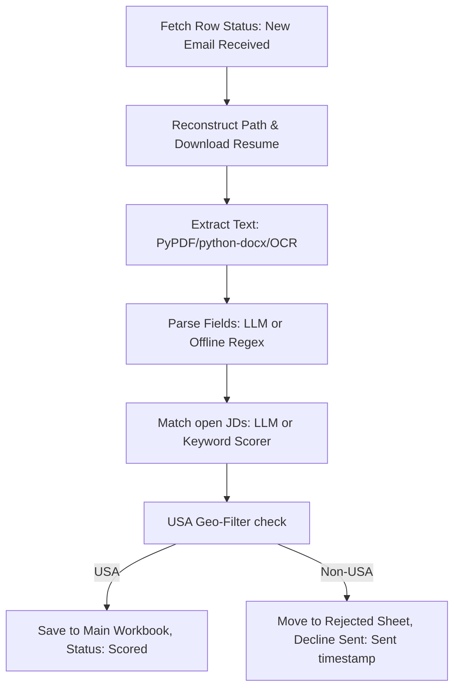

# Phase 2 (Scoring Client) Detailed Architectural Summary

**Phase 2** (`HiringAgent_App_P2`) acts as the scoring client and pipeline executor of the hiring pipeline. It can run serverlessly in the cloud (Azure Functions, GitHub Actions), as a background daemon CLI, or as a local Desktop GUI. It reads pending rows from the SharePoint workbook, extracts and scores their resumes against active job descriptions, applies the USA-only location filter, and updates the SharePoint rows.

---

## 1. Trigger Modes & Invocation

Phase 2 executes the core scoring pipeline (`score_from_sharepoint()`) through three trigger modes:
1. **Azure Functions (Cloud Scheduled):** Runs by timer trigger only when `HIRING_ENABLE_P2_TIMER=true` and `HIRING_P2_DISABLED` is not true. An HTTP webhook endpoint also exists so Phase 1 can notify the function to trigger scoring instantly. Timeout is set to **10 minutes** (`host.json`).
2. **GitHub Actions (Cloud Cron):** Runs on a scheduled workflow (typically every 30 minutes) using standard repository secrets.
3. **Local Desktop App / CLI:** Run on-demand by double-clicking `Launch.bat` or executing `python bot.py --score-sharepoint`.

---

## 2. Surgical Pipeline Executions (Per Row)

To prevent Azure timeout issues and respect API throttling, Phase 2 scoring is limited to a batch size of **25 candidates per run** (`SCORING_BATCH_LIMIT` in config). 

For each pending candidate row (`Status = "New Email Received"`), the following operations run inside an isolated `try/except` block (so a corrupt resume never halts the batch):

### Step 1: Resume Retrieval
Phase 2 reads the candidate's `Received Date` from the Excel row and reconstructs the dated folder path (`Downloaded_Resumes/<Year>/<Month>/`). It then downloads the resume file to a temporary local scratch directory.
* **Update reconciliation (fixed 2026-07-15):** P1 always saves a resume under one stable shape, `<FirstLast>_<FullAppID>.<ext>` — on first arrival, a Duplicate resend, or a ref-quoted Update alike. P2 only ever renames a file *out* of that shape (into the `<FirstLast>_<Category>_<tail>` shape, see Step 5) right after scoring it. So on a re-score pass, that legacy shape re-appearing can only mean "P1 just wrote a fresh update" — `_download_resume_text` (`sharepoint_scoring.py`) always prefers it over a stale already-renamed file for the same Application ID, scores off it alone (never blended with the prior content), and deletes the stale sibling once the rename lands. This is exactly the path a candidate replying to the Step 6 missing-info nudge goes through.

### Step 2: Text Extraction
Reads file contents:
* **PDFs/DOCX:** Extracted using `pypdf` or `python-docx`.
* **Broken/Scanned PDFs:** P2 extracts PDF text page-by-page with pypdf, falls back to `pdfplumber` when pypdf returns no readable text, and can optionally use OCR (Tesseract engine) for image-only PDFs when the desktop extras are installed.

### Step 3: Information Parsing (`extract_candidate_details_smart`)
Extracts applicant metadata (Full Name, Phone, Location, Country, Current Skills, **Education**, Looking For Role, and Portfolios). `Education` (added 2026-07-15) is the candidate's highest degree + field of study, plus school if given — same tiered pipeline as the other fields (deterministic regex hint, Ollama confirms/corrects).
* **Ollama Mode (local LLM):** Extracts details using structured prompts when local Ollama is enabled.
* **Offline Scorer Mode (Default/Fallback):** Parses details via regex rules and email header matching.
* **Phone Renormalization:** Formats phone numbers uniformly to `(XXX) XXX-XXXX` format.

### Step 4: Role Matching & Categorization
Calculates compatibility matches against active Job Descriptions (JDs):
* **JD Sources:** Loaded dynamically from `jd_sources.json` (auto-scans SharePoint directories; cache expires every 24 hours) falling back to `default_roles` in `config.yaml`.
* **Matching:** Matches skills against the job requirements and returns the top 3 unique matches as `Suggested Role 1/2/3` with matching percentages. Non-job/admin documents such as offer-letter info are filtered out of the scoring set, and duplicate JD titles are collapsed so the same visible role is not written twice.
* **Category Mapping:** Maps the top-matching role to one of the departments defined in `role_categories.rules` (config.yaml) — `Senior & Executive`, `AI/ML/CV (SIN2)`, `Data Analytics`, `3D/CV/ IoT/ AI Agents (SIN3)`, `Cloud and DevOps`, `Web Team (Full stack/Back end & UI/UX)`, `Graphics` (added 2026-07-15 — design/rendering/gaming, split out of Web Team), `Mobile Apps (Android IOS)`, `Business Analytics` (marketing roles route here too, also added 2026-07-15), `Supply Chain`, `Finance`, `Cybersecurity and IT Admin`, `Data Center`, `Satellite`, falling back to `General` for anything unmatched. First-match-wins substring rules, config-driven — no code change needed to add a new mapping. (A bare `"developer"`/`"engineer"` catch-all fallback was removed 2026-07-15 — it was silently routing non-web roles like "RPA / Automation Engineer" and "Intern / Entry-Level Engineer" into Web Team instead of General; every genuine Web Team role already has its own specific rule earlier in the list, so nothing needed it.) **Exception (2026-07-24):** before these title rules run at all, an unambiguous native-mobile skill stack in `Current Skills` (Kotlin, Swift, Flutter, Jetpack Compose, SwiftUI, React Native, etc. — see `_MOBILE_TOOL_SKILLS` in `hiring_agent/scoring.py`) routes straight to `Mobile Apps (Android IOS)`, unless a game-engine skill (Unity, Unreal, etc.) is also present. This closes a real gap: a plain Android/Kotlin developer's winning JD title sometimes landed in an unrelated category first (e.g. a JD titled "... Lead Developer ..." matched the `"lead"` -> `Senior & Executive` rule before "mobile"/"android" ever got checked), miscategorizing candidates who were never senior/executive at all (one confirmed live case was literally an intern). Not config-driven — see `assign_category()`.

### Step 5: USA Location Filter
Current policy (updated 2026-07-28) is tri-state: `confirmed_us`, `confirmed_non_us`, or `unknown`. Only confirmed non-US evidence moves a candidate to `Rejected - Non-USA Location`. Missing or conflicting current-location evidence stays on the main sheet as `Needs Review - Location Confirmation`, even after an updated-resume follow-up. A US phone, university, or employer prevents an unsafe rejection but does not prove current residence, fabricate Location/Country, or make the row eligible for the scored-results export.

Checks the candidate's extracted `Country` and `Location` values.
* **USA Location:** Candidate is accepted. The row is updated with all 15 P2-owned scored columns (Full Name, Phone, Location, Country, Current Skills, Education, Looking For Role, Suggested Role 1-3, Category, Portfolio 1-3, Status), and `Status` is flipped to `"Scored"`. The saved resume is also renamed at this point to `<FirstNameLastName>_<Category>_<tail>.<ext>` (e.g. `JaneDoe_DataAnalytics_A5F2.pdf`, `tail` = the AppID's own hex tail — changed 2026-07-15, was `<FirstLast>_<AppID>`).
  The workbook's visible `Resume Link` label remains the candidate's `Original Filename` while linking to the final P2-owned `Resume URL`.
* **Unknown/conflicting Location:** Candidate remains on the main sheet as `"Needs Review - Location Confirmation"`. No decline is queued, and the row is excluded from `Candidate_List_Results.xlsx` until current US residence is confirmed.
* **Non-USA Location:** Candidate is declined only when current non-US evidence is confirmed. The row is moved to the **`Rejected`** worksheet, its status is changed to `"Rejected - Non-USA Location"`, its resume file is moved into a single **year-level** `<Year>/Rejected/` folder (changed 2026-07-15 — was one `Rejected/` subfolder per month), and the `"Decline Sent"` column is left blank so the separate decline-mail pass (below) picks it up.

Concrete current US location evidence is a state, ZIP, territory, or recognizable US city in the extracted current-location field. A US phone or US education/work context is supporting evidence only: it can contradict a stale foreign hometown/degree extraction and route the row to review, but cannot independently confirm residence. A bare country field also remains unknown without a confirmed current location.

**Correction (2026-07-24):** the "US phone" signal above was accepted by `check_location_usa()`'s signature and passed in by the live pipeline since 2026-07-12, but was never actually read inside the country-field branch - it only contradicted nothing. Fixed: a US-shaped phone now overrides a foreign **Country field** specifically when the Location field itself is blank/ambiguous. Separately, and more significantly, an explicit foreign **Location** value - previously an unconditional, zero-cross-check reject - now also requires Phone or Education corroboration before it rejects at all (see the corroboration rule above); a US-shaped phone or US-reading education now converts that would-be reject into a kept-for-clarification row instead. The same NANP check also now excludes Canadian area codes (e.g. Ontario's 519) so a genuinely Canadian phone number doesn't misread as "looks like a US phone." Covered by regression tests in `test_p2.py` §O2b/§O2c.

### Step 6: Missing-Info Nudge (Scored and location-review candidates)
The nudge is also used for current-location clarification. P1 captures an updated resume reply back onto the same SharePoint row; on the next P2 run, clear USA becomes scored, clear corroborated non-USA rejects, and still-conflicting location remains in manual location review.

Duplicate cleanup keeps the newest row by `Received Date` and may heal missing scored/profile fields from an older duplicate, but it never copies P1-owned identity, date, mail, original filename, or resume URL/path fields from the older row into the newer row.

After a candidate is accepted and scored, a separate pass checks whether **Phone, Location, Current Skills, or Education** came back blank (Portfolio is not checked). It also asks for **current location/country** when a kept row has a nonblank but ambiguous location that is neither a concrete US signal nor a concrete foreign signal. If any are missing or unclear, a one-time email asks the candidate to reply **with an updated resume attached** containing that information — a plain-text reply is never actually captured downstream, so the copy is deliberately worded to point at the one path that gets re-scored. Tracked via the main-sheet-only `Info Request Sent` column so it never asks twice; historical rows stamped `Nothing missing` can be reopened only for this newer location-clarity rule, while `Sent ...` remains final. This never replaces a geography rejection: clear non-USA candidates still move to Rejected, while only unclear kept/scored candidates get a nudge.

### Step 6a: Client Export Period Separators (added 2026-07-31, sort direction fixed later the same day)
`_with_period_separators()` (`sharepoint_scoring.py`) always inserts one fully blank row under the header of `Candidate_List_Results.xlsx`, even for an empty export, plus one between each calendar month, matching the visual rhythm of the CandidateList sheet's own order. Separators are blank in every column and carry no `Application ID`, so every reader skips them. A blank/unparseable `Received Date` is treated as *no period* — without that guard `_parse_received` returns a fallback date and a single dateless row injects a spurious separator on both sides of itself (caught by the tests, fixed before release).

**Fixed later 2026-07-31:** `export_client_results()` now sorts `reverse=True` (current month first, newest within a month first) instead of ascending — this was a real gap, since the whole reason `_with_period_separators` exists is to make the export "read the same way" as the live sheet, and the live CandidateList sheet was switched to descending order that same day by `resort_candidate_sheets.py` (§6c below) while this export was left ascending. A year boundary is now also a **labeled** separator (`-- YYYY --`, written into the `Full Name` column) instead of a plain blank, matching `resort_candidate_sheets.py`'s `SEP_LABEL_FMT`/`YEAR_LABEL_COLUMN` — the two must stay in sync (see the comment above `_YEAR_SEP_LABEL_FMT` in `sharepoint_scoring.py`). Covered by `test_p2.py` §W2.

### Step 6a-2: Rejected Sheet Period Separators (added 2026-07-31)
The Rejected sheet is appended one row at a time (unlike the client export, which is rebuilt whole), so `_ensure_rejected_period_separator()` decides per insert: it compares the incoming rejection's month with the **physically last** nonblank Rejected row and adds a single fully blank row when that boundary changes. This also handles an out-of-order row that reopens an older month. A year change is also a month change, so exactly **one** blank lands either way. The very first Rejected row gets no separator, since the permanent spacer under the header already provides that gap. It does **not** currently emit a labeled year separator like the other two mechanisms (§6a, §6c) — it only ever compares two physically-adjacent periods, so a labeled marker doesn't fit its incremental design the same way; left as a plain blank on purpose.

It takes the **raw** Received Date rather than a parsed datetime on purpose: `_parse_received` returns a fallback date instead of `None` for blank or garbage input, so parsing at the call site would make a dateless row look like a brand-new period and insert a spurious blank. Wired into all four append sites (give-up path, `_finish_rejection`, and both recheck flows) and fully best-effort - any failure is logged and swallowed, because a cosmetic blank row must never stop a real rejection being recorded. Covered by `test_p2.py` §W3.

**Interaction with `resort_candidate_sheets.py` (§6c) — worth knowing, not a bug:** this function's "physically last row" comparison assumes rows are still roughly in append order. If the Rejected sheet is ever resorted into descending (current-month-first) order and new rejections keep appending afterward, this comparison will still make a locally-sensible decision (blank between whatever's physically last and the new row), but the sheet's *overall* grouping will start to fragment between resorts, same as CandidateList (see §6c's own note). Re-running the resort periodically is the only fix; nothing here is incorrect on its own.

### Step 6c: SharePoint Sheet Resort — Current Month First (added 2026-07-31)
`resort_candidate_sheets.py` (standalone script, project root — not wired into the scoring pipeline or run automatically) re-sorts the live **CandidateList** and **Rejected** SharePoint tables so the current month's rows come first, newest-within-a-month first, older months following below — mirroring the client export's own order (§6a) so all three artifacts (CandidateList, Rejected, `Candidate_List_Results.xlsx`) read the same way. One blank separator row between month groups; one **labeled** `-- YYYY --` row (in the `Full Name` column) at a year boundary instead of a plain blank; one permanent blank row directly under the header, matching P1's own convention.

**Safety design** (this workbook has been wiped before by careless bulk-write code — see `HiringAgent_P1/flow/build_zip.py`'s workbook self-heal history): backs up every row to local JSON first; computes the full desired order in memory and verifies the set of Application IDs is unchanged before writing anything; **adds** all rows in final order to the bottom of the table first (genuine `AddRowV2`/`add_main_row` calls, so Excel's calculated `Resume Link` column auto-fills exactly as it always does — no raw range overwrite that could clobber a formula column); only deletes the old rows, highest index first, after verifying the new count landed; retries the post-write row-count check a few times before treating a short count as real failure (Excel Online Business has shown genuine eventual-consistency lag right after a burst of `AddRowV2` calls — confirmed live 2026-07-31, an immediate read under-reported by exactly one row that a follow-up read moments later showed was actually there). A failure partway through the add phase aborts **without deleting anything**, so the original rows are always either fully intact or fully replaced, never in between. `--dry-run` prints the full plan (verified against live data before every run this session) without writing.

**Known limitation — the sort is a snapshot, not self-maintaining.** Neither P1's `AddRowV2` nor `add_main_row`/`add_rejected_row` can insert at the top of a table (Excel Online Business has no such action) — every new row/rejection still lands at the physical *bottom*, which is the wrong end once the sheet is in descending order. So the grouping will gradually fragment as new candidates/rejections arrive after a resort, until the resort is re-run. Whether to automate that (e.g., once per scoring session, or on a schedule) is an open decision, not yet implemented.

**Live repair, 2026-07-31:** running this surfaced and fixed a related bug — `_merge_duplicate_candidates`'s tie-break on an *exact* Received-Date collision between two duplicate rows used to pick the winner by physical table position (`-pos`, meaning "whichever row appears earlier in the table"), which only meant "the earlier-created row" because the table was always in append order. Now tie-breaks on Application ID instead, which is stable regardless of table order. Narrow real-world impact (only fires when two duplicate candidates share the exact same Received Date to the second) but was silently relying on an invariant this feature broke.

### Step 6b: Master Email Kill-Switch (added 2026-07-31)
`HIRING_SUPPRESS_EMAILS=true` (or `test_mode.suppress_emails: true` in `config.yaml`) stops every outbound P2 email while the rest of the pipeline runs untouched: rows are scored and patched, resumes renamed and moved, the Rejected sheet maintained, the client workbook exported. P1 uses its separate `flow_config.json` setting `email.send_applicant_emails`; the two are independent and both must suppress applicant mail for a fully silent replay.

Enforcement lives inside `SharePointClient.send_mail()` rather than at each call site, deliberately. `GEO_REJECT_EMAIL` gates the decline and `ERROR_EMAIL_ENABLED` gates the admin alert, but the **missing-info nudge has never had a flag of its own** — it fires on any scored row with a gap — so turning both existing flags off did *not* silence P2. Gating the one function every sender calls makes that class of omission impossible.

Suppressed rows are stamped `TEST-MODE (suppressed) Sent <ts>` in `Mail Sent` / `Decline Sent` / `Info Request Sent`. The stamp is still parseable by `_parse_marker_datetime`, so the idempotent passes treat the row as handled and never re-send it, and a replayed row is never mistaken for a real contact. Must be returned to `false` after a replay. Covered by `test_p2.py` §X (zero Graph calls while suppressed).

---

## 3. Resilience & Error Capping

* **Individual Row Retry:** If a row fails to process (e.g., download timeout or corrupt file), its `Retry Count` is incremented. The row remains untouched in the queue with `Status = "New Email Received"` to retry on the next schedule.
* **Duplicate Merge Guard:** Duplicate cleanup skips rows that are still active queue items (`New Email Received`, blank status, or `Needs Review - Unreadable Resume`). Fresh updates are scored before any older duplicate row can be collapsed into them.
* **Retry Cap:** If a row fails **3 times** consecutively:
  1. The client gives up.
  2. The row is moved to the **`Rejected`** worksheet with `Status = "Rejected - Processing Error"`.
  3. The `Decline Sent` column is pre-stamped so no decline template is emailed.
  4. An email alert is fired to the admin (`yashv@driverai.io`) for manual review.

---

## 4. Configuration & State Mappings

| Config Source | Purpose |
|:---|:---|
| **`.env`** | Client secrets, app registry IDs, tenant GUIDs, and site path variables. |
| **`config.yaml`** | All business settings: scoring weights, `role_categories.rules` (15 departments incl. `General`), default fallback roles, and 4 stored email templates — but only 2 are actually live: `rejection_non_usa` and `missing_info`, both read directly by `sharepoint_scoring.py`. **Correction (2026-07-15):** `acknowledgment`/`request_cv` are *not* P1-sent — `build_zip.py` never reads `config.yaml` at all; P1's real Acknowledgment/Request-CV content is hardcoded in `flow/_pristine_send_actions.json` and differs from what's stored here. These two config.yaml entries are dead, unread config on both sides — see `HiringAgent_P1/docs/MAIL_REPLIES.md`. |
| **`jd_sources.json`** | SharePoint JD sync configs, folder paths, and parsed cache state. |
| **`app_settings.json`** | GUI window layout settings and UI preferences. |
| **`run_history.jsonl`** | Log of local files scored in the Desktop GUI. |

---

## 5. Extraction & Data-Integrity Fixes (2026-08-01)

A row-by-row audit of every scored candidate against their actual resume text surfaced a
cluster of defects that all shared one root cause: **a value that looked structurally
valid but was never verified against the source document.** Each is now fixed at the code
level with a regression test, so it cannot silently return.

### Field extraction

| Fix | Live case that exposed it |
|:---|:---|
| Location is never taken from a school's own name | `University of Delhi` in the Education section became the candidate's current Location, despite her most recent affiliation being Arizona State |
| Location holds city/state only — never a bare country | `Location: India` duplicated `India` into both Location and Country. Falls back to `Remote` when the resume says so, else `N/A` |
| Location/Country self-contradiction guard | A stray `MS` in a tools list ("Bloomberg Terminal, MS Project") produced Location `Bloomberg Terminal, MS` + Country `United States` for an India-based candidate |
| `"City, ST"` must not match a comma-separated tools list | Same case — the match is rejected when another capitalized word follows |
| Role keywords are word-bounded | `rpa` matched inside `counterparties`, tagging a Financial Analyst as an "Automation / RPA Engineer" |
| `"for the X position"` phrasing | The role name precedes the keyword; the old pattern skipped it and captured a fragment of the *next* sentence |
| 4-letter role acronyms preserved | `CISO` was being normalized to `Ciso` |
| Header role cap raised 6 → 8 words | `Fractional/Interim Chief Marketing Officer & Marketing Advisor` (7 words) was rejected, so a CMO fell through to a generic keyword guess |
| Middle initials recognized offline | `Christopher L. Feld` / `Jane Q Public` returned `Not extracted` from the offline parser — masked in production because Ollama resolves names independently, broken on the documented offline fallback |
| Company names rejected as person names | A vendor brochure's tagline `Transforming Business Models` was stored as Full Name |

### Skills & portfolios

| Fix | Live case |
|:---|:---|
| AI prompt no longer names concrete example skills | The prompt's own `e.g. Python, AWS, Docker, React, Swift` was echoed back as hallucinated skills on unrelated candidates — a B2B marketer's row listed Python/Docker/React |
| `SQL` / `MQL` marketing-metric exclusion | `reported MQLs, SQLs`, `MQL-to-SQL handoff` are lead-funnel metrics, not the database language |
| `AWS re:Invent` exclusion | A conference the candidate ran marketing for, not a cloud skill |
| Bare `word.io` / `.dev` / `.me` no longer accepted as a portfolio | `Socket.io` (a library) and `Loquatinc.io` (a client company) were both stored as personal portfolio URLs. A bare domain now needs an explicit scheme or nearby "portfolio" context |

### Geo

* **Unformatted 10-digit phones are no longer trusted as US numbers.** A bare Indian mobile (`7405465204`, no separators, no `+91`) coincidentally matched the NANP area-code shape and overrode an explicit `Ahmedabad` location, leaving a clearly non-US candidate in Needs Review. A separator or `+` country code is now required — every protected US-phone regression case already has one.

### Row completeness (the structural fix)

`_validate_all_columns` was marking `Category`, `Status`, and `Suggested Role 1/2/3` as **OK
without reading their values**, so rows with a blank Category and blank Suggested Roles
produced a clean `Col check` log line and passed straight through to the terminal Rejected
sheet, where nothing ever re-scores them.

Two changes:

1. **`_validate_all_columns` now actually validates.** `Category` is re-derived via
   `assign_category` (guaranteed non-blank) and logged as healed; a blank `Status` or
   `Suggested Role 1` logs a warning instead of a silent pass. `Suggested Role 2/3` are
   still legitimately blank when the scorer returns fewer than three matches.
2. **`_complete_row_before_reject()` gates every path to the Rejected sheet** — all five
   call sites (normal rejection, duplicate-refresh, give-up-after-failures, and both
   reconcile paths). Deterministic repairs only, no network or LLM: Category filled,
   blank Portfolios → `N/A`, blank counters → `0`, and anything still missing is logged
   loudly rather than silently accepted.

### Offline dry-run harness

`dry_run_p1_p2_scenarios.py` (repo root) exercises P1's four mail gates and P2's scoring
decisions against dummy data with **zero SharePoint writes and no mail sent** — intended to
be run before re-importing the P1 zip. It reads the real phrase lists from
`flow_config.json` and calls P2's real production functions, so it cannot drift from the
shipped logic. The middle-initial bug above was found by this harness, not by the live audit.
