# Phase 1 (Intake Flow) — Detailed Architectural Summary

The front door of the hiring pipeline is **Phase 1** (`HiringAgent_P1`), a serverless Power Automate flow (`DriverAI_HiringAgent_P1_AutoReply`). It watches the shared inbox, filters out spam/system mail, saves incoming resumes, creates candidate rows in SharePoint, and emails applicants back. It never reads a resume's content and never runs a model — that's entirely Phase 2's job. This doc reflects the state as of **2026-07-24**, after the 2026-07-12 code audit, the 2026-07-15 config-driven AppRef change plus the sender-address normalization fix (§9), and the later addition of the year-boundary separator row and the test_mode.suppress_emails toggle (§1A).

---

## 1. Trigger Mechanism & Watermark

* **Trigger action:** `When a new email arrives in a shared mailbox (V2)`
* **Inbox monitored:** `apply@driverai.io` (root `Inbox` folder only).
* **Poll interval:** **1 minute** (`trigger.interval_min` in `flow_config.json` — platform minimum; a change only takes effect after re-importing the rebuilt zip, Power Automate cannot alter a trigger interval at runtime).
* **splitOn:** `true` — each email triggers a separate run.
* **Concurrency:** strictly **1**. Every branch reads-then-writes the same Excel row (`Get_rows` → `Add_row`/`Patch_*`); raising this risks duplicate rows or duplicate AppRef reuse under burst load.
* **Watermark behavior:** advances on arrival timestamp regardless of run outcome. A failed run leaves the email unread and alerts the admin — there is no automatic retry; recovery is manual (`trigger_reset.py`, Archive-folder replay only — see §8).

---

## 1A. Year-Boundary Separator Row & Test Mode

* **Year-boundary separator row** (`flow_config.json: year_separator.enabled`, default `true`): before writing the first candidate row of a new calendar year, `build_zip.py` (`Get_rows_this_year` -> `IsFirstOfNewYear` -> `Add_row_year_separator`) inserts one truly blank row (no column values at all) into the Excel table first, purely as a visual year break when scrolling the sheet. It runs before `Add_row`, checked via an `If` that filters existing rows on `Received Date ge <thisYear>-01-01`; `Add_row` proceeds regardless of this check's own outcome, so a failure here never blocks the real candidate row.

* **Month-boundary separator row** (`flow_config.json: month_separator.enabled`, default `true`, added 2026-07-31): the same mechanism per calendar month — `Get_rows_this_month` -> `IsFirstOfNewMonth` -> `Add_row_month_separator`. The `$filter` is bounded to a single month (`Received Date ge <startOfMonth> and lt <startOfMonth + 1 Month>`), so like the year check it never scans the whole table. **A January arrival is both a new year and a new month**, and two stacked blank rows would read as a mistake — so the month condition is deliberately compound: *no rows this month* **AND** *at least one row already this year*. That makes the year separator win at a year boundary and guarantees exactly one blank row at any boundary. If `year_separator` is turned off, the build drops the second clause automatically so the month check still works standalone. `Add_row` waits on both checks (`Succeeded`/`Failed`/`Skipped`), so a separator failure can never block a real candidate row, and the PATCH-only paths (duplicate / update / follow-up) never reference either feature since they don't add rows at all. Covered by `test_p1.py` §N2.
* **Test mode** (`flow_config.json: test_mode.suppress_emails`, default `false` in a live build): when `true`, all 6 applicant-facing sends plus `Notify_failure` are replaced with no-op `Compose` actions instead of real connector calls, and every conditional `Mail Sent` stamp is swapped to a `"TEST-MODE (suppressed) <timestamp>"` marker instead of `"Sent <timestamp>"` — so a historical-replay/testing run never actually emails anyone, while still leaving an audit trail distinguishable from a real send. `test_p1.py` §O asserts a live build has zero TEST-MODE stamps and every send action is a real mail-connector call.

---

## 2. What P1 Fills In — The 11-Column Contract

The live table has **30 columns** (27 at the 2026-07-04 baseline; grew to 29 on 2026-07-14 when P2 added `Education` and `Info Request Sent`; grew to 30 on 2026-07-15 when P1 added `Last Updated Date`). P1 writes **only 11** of them at row creation; the other 19 land as blank cells for P2 scoring/resume metadata plus later audit stamps.

| Column | Value/Expression | Purpose |
|:---|:---|:---|
| **Application ID** | `@outputs('AppRef')` | Unique reference key, e.g. `APP-20260710-2200-A1B2` |
| **Received Date** | `formatDateTime(receivedDateTime, 'yyyy-MM-ddTHH:mm:ss')` | ISO-8601, no timezone offset |
| **Last Updated Date** | `formatDateTime(receivedDateTime, 'yyyy-MM-ddTHH:mm:ss')` | Same as Received Date on first intake; refreshed only when a resume update/resend is saved |
| **Full Name** | Heuristic guess | Sender display name if present, else cleaned email local-part |
| **Email** | `from` | Raw sender address (see §9 for a known matching caveat) |
| **Mail Subject** | `subject` | — |
| **Mail Body** | `body/bodyPreview` | Outlook's plain-text preview, ~255 chars (not the full HTML body, no 30KB cap) |
| **Status** | `"New Email Received"` | Signals P2 the row is ready to score |
| **Has Resume** | `"Yes"` | Invariant — a row only exists if a real CV was attached |
| **Original Filename** | `item()?['name']` | As sent by the candidate, joined with `, ` if multiple |
| **Application Updates** | `0` | Shared counter driving every cap (see §7) |

Deliberately **not** listed in the intake write: Category, Phone, Location, Country, Current Skills, Education, Looking For Role, Suggested Role 1-3, Portfolio 1-3, Retry Count, Resume URL, Resume Link, Resume Folder Path, Info Request Sent, Mail Sent. Writing only the 11 real values (rather than all 30 with 19 empty strings) minimizes the import-time schema-binding surface — listing every column forces Power Automate to resolve that many column-name matches against the live table at import time, and any one mismatch can silently drop a field in the designer.

---

## 3. Application Reference (AppRef) — now config-driven

Format: **`APP-<yyyyMMdd>-<HHmm>-<4hex>`** (22 chars, minute precision), e.g. `APP-20260710-2200-A5F2`.

As of this session, the shape is no longer hardcoded in `build_zip.py` — `flow_config.json`'s `appref` block carries it directly:

```json
"appref": {
  "date_format": "yyyyMMdd",
  "time_format": "HHmm",
  "hex_length": 4,
  "detect_pattern": "app-20"
}
```

`_ref_len` (used to extract a quoted ref out of a reply email) is computed from these same two values at build time, so minting and extraction can never drift apart even if the shape changes later — change `time_format`/`hex_length`, rebuild, re-import, and both sides move together automatically. Rebuilt and reverified this session: `definition.json` came out **byte-identical** to the pre-change file, confirming this was a pure config-plumbing change with zero behavior drift (defaults match what was previously hardcoded).

`detect_pattern` (`"app-20"`) is the case-insensitive substring that flags a reply as quoting a reference — decade-proof through 2099, matched anywhere in subject or body, deliberately **not** added to `bad_subjects` (that would drop an applicant's own `Re: <our subject>` reply before the ref gate ever sees it).

---

## 4. Resume Storage

* **Root:** `Candidate_Resumes/`
* **Dated path:** `Candidate_Resumes/<Year>/<Month>/` (e.g. `2026/July/`) — weekly subfolders were deprecated and removed.
* **Auto-creation:** `CreateNewFolder` (`Ensure_*_resume_folder`) runs immediately before each save; safe no-op if the folder already exists. No artificial delays — testing showed folder→file save works reliably without one.
* **Saved filename at P1 intake:** `<FirstLast>_<AppRef>.<ext>` (e.g. `JaneDoe_APP-20260710-2200-A5F2.pdf`) — changed 2026-07-12 from the older `<AppRef>_<original>` shape. `FirstLast` strips apostrophe/hyphen/period/comma from the candidate's name and keeps first+last word (or `Candidate` if the name is empty), mirroring P2's own `_get_cleaned_filename_prefix()` exactly.
* **Renamed again by P2 once scored** (2026-07-15, client request): `<FirstLast>_<Category>_<tail>.<ext>` (e.g. `JaneDoe_DataAnalytics_A5F2.pdf`) — Category can't be known at P1's intake stage (it's a P2-only field, assigned during scoring), so this second rename is P2's job, not P1's. `<tail>` is the AppRef's own last hyphen-segment, kept so two same-name-same-category candidates never collide now that the full AppRef is no longer visible in the name. A one-time bulk migration (`HiringAgent_App_P2/migrate_resume_filenames.py`) renamed every already-scored resume to this format the same day.
* **Workbook:** single file in `Master_Files/`, no `<Year>` segment - one workbook covers every year.
* **Self-heal:** **off, on purpose** (removed 2026-07-04). The old metadata probe produced false "not found" results and re-uploaded a blank template over real data, wiping rows. Now: a genuinely missing workbook fails the run and pages the admin via `Notify_failure`, and a human restores it once from `P1_Templates/HiringAgent_P1_CandidateList.xlsx` — never silently replaced.

---

## 5. Email Routing Logic & Spam Gates

Three consecutive, case-insensitive substring gates run before anything else:

```mermaid
graph TD
    Email[Incoming Email] --> G1[Gate 1: Bad Sender — 32 rules]
    G1 -- Match --> Junk[Junk Email, left UNREAD, Terminate]
    G1 -- Pass --> G2[Gate 2: Bad Subject — 24 rules]
    G2 -- Match --> Junk
    G2 -- Pass --> G3[Gate 3: Content — 111 phrases]
    G3 -- Match, no CV --> Junk
    G3 -- Match, CV present --> G3B[Link-shortener check — 12 domains]
    G3B -- Match --> WorkBranch[Work Branch]
    G3 -- Pass --> WorkBranch
```



* **Gate 1 — Bad Sender (31):** notification/system bots, marketing platforms (LinkedIn, Slack, Zoom, Calendly, GitHub, DocuSign, Mailchimp, SendGrid, Salesforce, Facebook, Dropbox, Notion, Asana...), and the self-loop guard (`apply@driverai.io` itself, plus mailer-daemon/postmaster/bounce). Sender-based, not subject-based — deliberately, so an applicant's `Re:` reply is never caught by the loop guard. Matching is an unanchored `contains` over the raw From header, so every term must be safe as a substring: `marketing@` was removed 2026-07-31 after it matched `redactedmarketing@example.com`, a real CMO applicant junked three times.
* **Gate 2 — Bad Subject (24):** invoices, password resets, out-of-office, delivery failures, and three retired outbound subjects (so a bounce of P1's *own* old emails doesn't loop back in). Narrowed 2026-07-31: the bare tokens `alert`/`invoice`/`receipt`/`payment`/`survey` also matched real job titles ("Alert Systems Engineer", "Payments Platform", "Land Surveyor") and are now specific phrases.
* **Gate 3 — Content (111 = 30 scam + 36 offensive + 20 malware-extension/phrase + 25 non-English scam):** scans subject + body + attachment names. Offensive-phrase list deliberately avoids bare high-false-positive tokens (no standalone `sex`/`ass`/`hell` — only full phrases like `sex chat`). Executable extensions are stored **space-terminated** (`".exe "`) and `LowerBody` appends a trailing space, so a real attachment matches while `www.exeter.ac.uk` and `www.iso.org` no longer read as malware.
* **Gate 3b — Link shorteners (12, conditional):** only blocks when there's *no* valid PDF/DOCX attached — a resume with a shortened LinkedIn icon in the signature is common and legitimate, so a real attachment overrides this check.

All three gates route the same way on a match: move to **Junk Email**, leave **unread**, terminate silently — no reply, no row, no trace in Archive.

---

## 6. Work Branch Scenarios

| # | Incoming email | Row written? | Resume saved? | Reply |
|---|---|---|---|---|
| A | New applicant, PDF/DOCX, not a dup | **Yes** — the only row-writer in the flow | Yes, into `<Year>/<Month>/` | **Email 1** (acknowledgment) |
| B | Attachment present, wrong format (`.jpg`, `.zip`, ...) | No | No | **Email 4** (please resend as PDF/Word) |
| C | No attachment, has application keywords (`resume`, `cv`, `apply`, ...) | **No — CV-only table invariant** | No | **Email 3** (please attach CV) |
| D | No attachment, no keywords | No | No | none |

All four tidy the same way on completion: mark **read**, move to **Archive**.

---

## 7. Repeated Applicants — Capping & Overwriting

Matched against existing rows by sender email. Two entry points, sharing **one** `Application Updates` counter and a two-tier cap:

* **`duplicate_check_days = 90`** — the resubmit window (inclusive at exactly 90 days).
* **`*_max = 5`** — the hard ceiling per path (`duplicate_notice_max`, `update_resume_max`, `followup_reply_max`); the row goes fully silent forever (within the window) once hit.
* **`reply_cap = 3`** — a *smaller*, separate threshold. Contacts 1-3 still get an actual reply email (the 3rd is a final-notice variant). Contacts 4-5 still update the row/resume and re-queue it for P2 — but get **no email at all**. This two-tier design means the file and the SharePoint row both stay current even after the applicant stops hearing back, so P2 always scores the latest resume regardless of email noise.

| Scenario | No ref quoted (resend) | Ref quoted (`APP-20...` in reply) |
|---|---|---|
| Resume attached, <3 contacts | Email 2 (duplicate notice), resume saved under P1's standard name in the original folder¹ | Email 5 (update ack), same save¹ |
| Resume attached, 4-5 contacts | Silent — file/row still updated | Silent — file/row still updated |
| No resume, ref quoted, <3 contacts | n/a | Email 6 (noted reply) |
| Any path, ≥5 contacts | Fully silent, nothing saved | Fully silent, nothing saved |

Gate ordering matters: `HasAppRefGate` runs **before** `HasResume`, so a ref-reply with a resume attached is always handled as an update (never double-counted as a brand-new applicant).

¹ "Save" not "overwrite" is deliberate wording (corrected 2026-07-15): P1 always computes the same `<FirstLast>_<FullAppID>` target, which is a true in-place overwrite *only* if P2 hasn't scored the row yet. Once P2 has scored it, the file's been renamed to `<FirstLast>_<Category>_<tail>` — a shape P1 has no visibility into (Category is P2-only) — so this save lands as a fresh file alongside the stale renamed one. P2's next scoring pass (`_download_resume_text`, fixed 2026-07-15) always prefers that fresh file over the stale one and deletes the leftover, so the candidate still ends up with exactly one resume — just resolved a run later by P2, not atomically by this save. See `HiringAgent_App_P2/docs/p2_detailed_summary.md` §2 Step 1.

---

## 8. Error Handling, Recovery Tooling & Known Operational Gap

* **`Notify_failure`** fires on any core step failing/timing out — high-priority email to `yashv@driverai.io`, includes the AppRef for traceability. Inbox tidy is deliberately **skipped** on this path, so the original email stays unread as a visual "needs manual recovery" flag.
* **`trigger_reset.py`** replays historical mail through the live flow logic as if it just arrived — useful for backlog recovery or flow-change validation. **Known limitation, confirmed by the 2026-07-12 audit:** it only reads from `mailFolders/Archive/messages` (hardcoded). It has **no mode for mail already sitting in Inbox** — so it cannot be used to clear a backlog of un-triaged Inbox mail, only to replay mail that already made it to Archive. A separate Graph-based script is required for an Inbox-stuck backlog; this is a currently open, acknowledged gap, not something fixed in this pass.
* **`bulk_move_tool.py`** exists for bulk mailbox moves; its `--to-inbox` restore mode is the most likely cause if a large batch ever ends up stuck un-triaged in Inbox (a mass move with no per-item pacing can outrun the trigger's watermark).

---

## 9. Confirmed-Good, Known Limitations, and What "Maximum Potential" Would Still Need

The 2026-07-12 audit is the authoritative source for the original findings — **PASS, deployable as-is**, no correctness bug in the deployed logic. What follows is current state, split by whether each item is applied or still open. Current test count is tracked by `test_p1.py`; the latest run validates the upload ZIP, the loose generated definition, config, docs, and workbook template together.

**Fixed this session (verified, tests green):**
- AppRef time-format/hex-length exposed as real `flow_config.json` keys instead of hardcoded Python constants — the file's "single source of truth" claim is now actually true for this value. Verified byte-identical rebuild (zero drift).
- Every stale `HHmmss`/6-hex AppRef example across README.md, this file, and the audit prompt corrected to the real `HHmm`/4-hex shape.
- Stale historical column-count labels (comments and doc prose only — the executable assertions were already correct) corrected to the current 30-column main / 29-column Rejected contract throughout `test_p1.py`, `trigger_reset.py`, and this file.
- README's claim that the Rejected sheet is "auto-created by P2" corrected — it's already shipped inside `P1_Templates/HiringAgent_P1_CandidateList.xlsx`, so a first-time operator doesn't wonder why P2-looking content exists on day one.
- Row-schema table updated for the current 30-column contract, including `Education`, `Info Request Sent`, and P1-owned `Last Updated Date`. P1 now writes 11 intake fields on creation.
- **Sender-address matching normalized (audit finding 2, closed).** Both the `Get_rows`/`Get_rows_ref` `$filter` and the stored `Email` column now run through the same shared expression: lowercase, and if the address has a `Name <addr>` wrapper, only the `<addr>` part is kept. `jane@x.com`, `Jane@X.com`, and `"Jane Doe" <jane@x.com>` now all match the same row going forward. **Scope, by design:** this is forward-only — rows already written before this change keep whatever raw value they have; a resend from someone whose *existing* row has display-name cruft may still miss once, but their new email's own row (or any row written after this change) is stored normalized, so it matches cleanly from then on. No backfill of historical rows was done or requested. This is a real behavior change to live dedup logic — rebuilt and reverified via `test_p1.py`'s new §D2 (5 new assertions checking both sides normalize identically), **not yet deployed** — still needs the zip re-imported into Power Automate to take effect live (see the workflow note in `flow_config.json`'s own header).
- **Resume-update reconciliation fixed (2026-07-15).** Root cause traced to P1, but the actual fix landed entirely on the P2 side — see the ¹ footnote above and `p2_detailed_summary.md` §2 Step 1. Also corrected several comments in `build_zip.py` that had over-claimed a guaranteed "byte-identical overwrite" that stopped being universally true once P2's 2026-07-15 filename convention shipped.
- **Category catch-all bug fixed (P2-side, but affects roles P1's own `flow_config.json` open-role list can produce)** — a bare `"developer"`/`"engineer"` substring rule was silently routing non-web roles (e.g. "Intern / Entry-Level Engineer") into Web Team instead of General. Removed; see `p2_detailed_summary.md` §2 Step 4.
- **Setup template (`P1_Templates/HiringAgent_P1_CandidateList.xlsx`) was stale** — regenerated to match the current 30-column main table and 29-column Rejected table. `test_p1.py` §J cross-checks the template headers directly against P2's canonical column lists, so this can't silently drift again.

**Still open, deliberately not touched (each needs an explicit decision, not a silent fix):**
- **Malware detection is extension/phrase-substring only** — no magic-byte, MIME, or content scan, no size limit. A `resume.pdf` that's actually an executable, or a well-crafted malicious PDF, reaches SharePoint; O365/SharePoint's own AV is the only backstop. Hardening this is a real flow change (new actions, likely a new connector/Azure Function), not a config tweak — flagged as its own, separate design discussion, not started.
- **No sender allow-list**, **no rate-limit/429 backoff** beyond Power Automate's built-in per-action retry — both accepted gaps, not defects.
- **P1 is entirely untracked in git** (`git ls-files HiringAgent_P1` → empty) — nothing here is diffable against history. Worth deciding whether to start tracking it, independent of anything else in this doc.
- **`trigger_reset.py` can't touch Inbox-stuck mail** (§8) — the acknowledged gap behind the separate backfill-script effort.

**Bottom line on "maximum potential":** the sender-matching gap is now closed (pending live re-import). The extension-only malware check is addressed as of 2026-07-31 — not by a separate attachment gate, but by space-anchoring each extension against a space-terminated scan field, which removes the prose false positives at no structural risk. Remaining: two operational/tooling gaps (git tracking, Inbox-stuck backlog recovery) that aren't flow bugs at all.

**Spam-gate false-positive audit (2026-07-31).** All 167 terms were replayed against every message in the live mailbox (272 Archive + 6 Junk). Exactly one term had ever fired: `marketing@`, on three emails, all from the same genuine applicant. The other 166 had never matched anything. Seven terms were then proven unsafe by probe (`marketing@`, `alert`, `invoice`, `receipt`, `payment`, `survey`, plus `.exe`/`.iso` against `exeter.ac.uk`/`iso.org`) and fixed. Post-fix the same replay yields **zero hits across all 278 messages**. Note that three of the six Junk messages matched **no** P1 gate — those were junked by Exchange Online before the flow ever ran, which P1 cannot fix; they need a safe-sender or anti-spam policy change on the mailbox.

---

## 10. Coexistence Contract with Phase 2

Phase 1 writes `Status = "New Email Received"` and stops. Phase 2 (`../HiringAgent_App_P2/`) polls for that status, reads the resume, fills the P2-owned scoring columns, applies the USA-only geo-filter, and flips `Status` to `Scored` or moves the row to Rejected. Clear foreign current locations become `Rejected - Non-USA Location`; still-conflicting current-location rows become `Rejected - Location Not Confirmed` only after P2 already asked once for an updated resume and P1 re-queued that update back onto the same row. Neither phase calls the other directly - the SharePoint workbook is the only contract, and P1 never sends an email on P2's behalf. P2 outbound mail covers different triggers entirely: non-USA/location-not-confirmed decline and the missing-info/current-location nudge, both sent via Microsoft Graph directly, not through this flow.
