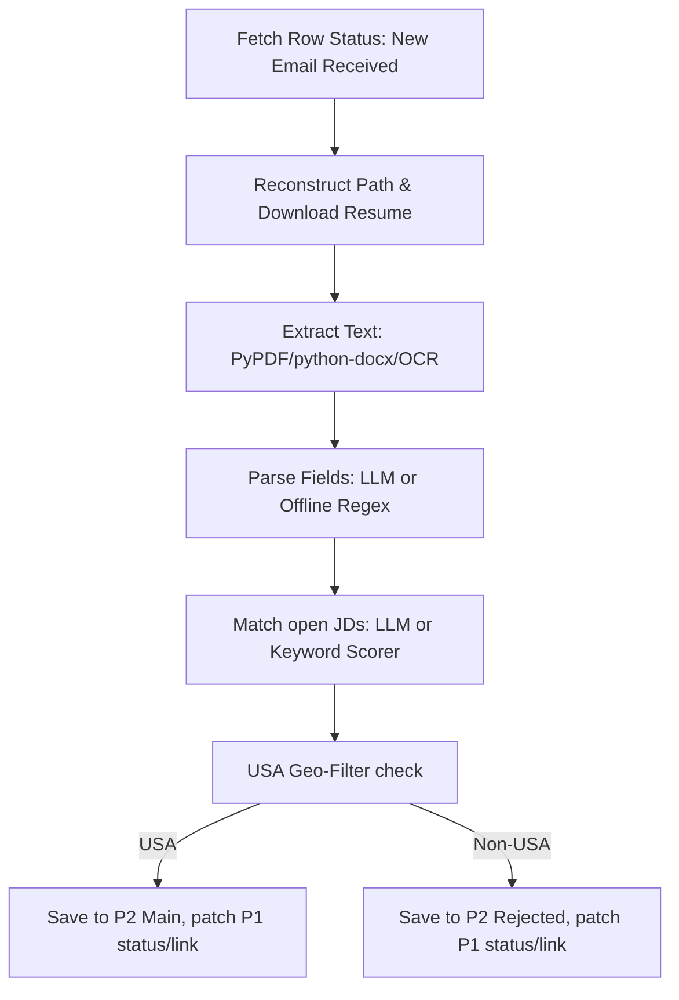

# Phase 2 (Scoring Client) Detailed Architectural Summary

**Phase 2** (`HiringAgent_P2`) acts as the scoring client and pipeline executor of the hiring pipeline. It reads pending rows from P1's SharePoint workbook, extracts and scores their resumes, and stores the full result in SQLite and `P2-MasterFile.xlsx`. It writes only `Status` and `Resume Link` back to P1's `CandidateList`.

---

## 1. Trigger Modes & Invocation

Phase 2 executes the core scoring pipeline (`score_from_sharepoint()`) through three trigger modes:
1. **Azure Functions (Cloud Scheduled):** Runs by timer trigger only when `HIRING_ENABLE_P2_TIMER=true` and `HIRING_P2_DISABLED` is not true. An HTTP webhook endpoint also exists so Phase 1 can notify the function to trigger scoring instantly. Timeout is set to **10 minutes** (`host.json`).
2. **GitHub Actions (Cloud Cron):** Runs on a scheduled workflow (typically every 30 minutes) using standard repository secrets.
3. **Local Desktop App / CLI:** Run on-demand by double-clicking `Launch.bat` or executing `python bot.py --score-sharepoint`.

---

## 2. Surgical Pipeline Executions (Per Row)

To prevent Azure timeout issues and respect API throttling, Phase 2 scoring is limited to a batch size of **25 candidates per run** (`SCORING_BATCH_LIMIT` in config). 

For each pending candidate row (`Status = "New Email Received"`), the following operations run inside an isolated `try/except` block (so a corrupt resume never halts the batch):

### Step 1: Resume Retrieval
Phase 2 reads the candidate's `Received Date` from the Excel row and reconstructs the dated folder path (`Downloaded_Resumes/<Year>/<Month>/`). It then downloads the resume file to a temporary local scratch directory.
* **Update reconciliation (fixed 2026-07-15):** P1 always saves a resume under one stable shape, `<FirstLast>_<FullAppID>.<ext>` — on first arrival, a Duplicate resend, or a ref-quoted Update alike. P2 only ever renames a file *out* of that shape (into the `<FirstLast>_<Category>_<tail>` shape, see Step 5) right after scoring it. So on a re-score pass, that legacy shape re-appearing can only mean "P1 just wrote a fresh update" — `_download_resume_text` (`sharepoint_scoring.py`) always prefers it over a stale already-renamed file for the same Application ID, scores off it alone (never blended with the prior content), and deletes the stale sibling once the rename lands. This is exactly the path a candidate replying to the Step 6 missing-info nudge goes through.

### Step 2: Text Extraction
Reads file contents:
* **PDFs/DOCX:** Extracted using `pypdf` or `python-docx`.
* **Broken/Scanned PDFs:** P2 extracts PDF text page-by-page with pypdf, falls back to `pdfplumber` when pypdf returns no readable text, and can optionally use OCR (Tesseract engine) for image-only PDFs when the desktop extras are installed.

### Step 3: Information Parsing (`extract_candidate_details_smart`)
Extracts applicant metadata (Full Name, Phone, Location, Country, Current Skills, **Education**, Looking For Role, and Portfolios). `Education` (added 2026-07-15) is the candidate's highest degree + field of study, plus school if given — same tiered pipeline as the other fields (deterministic regex hint, Ollama confirms/corrects).
* **Ollama Mode (local LLM):** Extracts details using structured prompts when local Ollama is enabled.
* **Offline Scorer Mode (Default/Fallback):** Parses details via regex rules and email header matching.
* **Phone Renormalization:** Formats phone numbers uniformly to `(XXX) XXX-XXXX` format.

### Step 4: Role Matching & Categorization
Calculates compatibility matches against active Job Descriptions (JDs):
* **JD Sources:** Loaded dynamically from `jd_sources.json` (auto-scans SharePoint directories; cache expires every 24 hours) falling back to `default_roles` in `config.yaml`.
* **Matching:** Matches skills against the job requirements and returns the top 3 unique matches as `Suggested Role 1/2/3` with matching percentages. Non-job/admin documents such as offer-letter info are filtered out of the scoring set, and duplicate JD titles are collapsed so the same visible role is not written twice.
* **Category Mapping:** Maps the top-matching role to one of the departments defined in `role_categories.rules` (config.yaml) — `Senior & Executive`, `AI/ML/CV (SIN2)`, `Data Analytics`, `3D/CV/ IoT/ AI Agents (SIN3)`, `Cloud and DevOps`, `Web Team (Full stack/Back end & UI/UX)`, `Graphics` (added 2026-07-15 — design/rendering/gaming, split out of Web Team), `Mobile Apps (Android IOS)`, `Business Analytics` (marketing roles route here too, also added 2026-07-15), `Supply Chain`, `Finance`, `Cybersecurity and IT Admin`, `Data Center`, `Satellite`, falling back to `General` for anything unmatched. First-match-wins substring rules, config-driven — no code change needed to add a new mapping. (A bare `"developer"`/`"engineer"` catch-all fallback was removed 2026-07-15 — it was silently routing non-web roles like "RPA / Automation Engineer" and "Intern / Entry-Level Engineer" into Web Team instead of General; every genuine Web Team role already has its own specific rule earlier in the list, so nothing needed it.) **Exception (2026-07-24):** before these title rules run at all, an unambiguous native-mobile skill stack in `Current Skills` (Kotlin, Swift, Flutter, Jetpack Compose, SwiftUI, React Native, etc. — see `_MOBILE_TOOL_SKILLS` in `hiring_agent/scoring.py`) routes straight to `Mobile Apps (Android IOS)`, unless a game-engine skill (Unity, Unreal, etc.) is also present. This closes a real gap: a plain Android/Kotlin developer's winning JD title sometimes landed in an unrelated category first (e.g. a JD titled "... Lead Developer ..." matched the `"lead"` -> `Senior & Executive` rule before "mobile"/"android" ever got checked), miscategorizing candidates who were never senior/executive at all (one confirmed live case was literally an intern). Not config-driven — see `assign_category()`.

### Step 5: USA Location Filter
Current policy (updated 2026-07-28) is tri-state: `confirmed_us`, `confirmed_non_us`, or `unknown`. Only confirmed non-US evidence moves a candidate to `Rejected - Non-USA Location`. Missing or conflicting current-location evidence stays on the main sheet as `Needs Review - Location Confirmation`, even after an updated-resume follow-up. A US phone, university, or employer prevents an unsafe rejection but does not prove current residence, fabricate Location/Country, or make the row eligible for the scored-results export.

Checks the candidate's extracted `Country` and `Location` values.
* **USA Location:** Candidate is accepted. The full extracted/scored row is saved in P2's local store and `P2-MasterFile.xlsx`, and P1 receives `Status = "Scored"` plus the renamed `Resume Link`. The saved resume is also renamed at this point to `<FirstNameLastName>_<Category>_<tail>.<ext>`.
  The workbook's visible `Resume Link` label remains the candidate's `Original Filename` while linking to the final P2-owned `Resume URL`.
* **Unknown/conflicting Location:** Candidate remains on the main sheet as `"Needs Review - Location Confirmation"`. No decline is queued, and the row is excluded from `Candidate_List_Results.xlsx` until current US residence is confirmed.
* **Non-USA Location:** Candidate is declined only when current non-US evidence is confirmed. The full row moves to the **`Rejected`** worksheet in `P2-MasterFile.xlsx`; P1 keeps the original intake row on `CandidateList` and receives only `Status = "Rejected - Non-USA Location"` and `Resume Link`. The resume file moves into the year-level `<Year>/Rejected/` folder, and P2's `Decline Sent` value drives the separate decline-mail pass.

Concrete current US location evidence is a state, ZIP, territory, or recognizable US city in the extracted current-location field. A US phone or US education/work context is supporting evidence only: it can contradict a stale foreign hometown/degree extraction and route the row to review, but cannot independently confirm residence. A bare country field also remains unknown without a confirmed current location.

**Correction (2026-07-24):** the "US phone" signal above was accepted by `check_location_usa()`'s signature and passed in by the live pipeline since 2026-07-12, but was never actually read inside the country-field branch - it only contradicted nothing. Fixed: a US-shaped phone now overrides a foreign **Country field** specifically when the Location field itself is blank/ambiguous. Separately, and more significantly, an explicit foreign **Location** value - previously an unconditional, zero-cross-check reject - now also requires Phone or Education corroboration before it rejects at all (see the corroboration rule above); a US-shaped phone or US-reading education now converts that would-be reject into a kept-for-clarification row instead. The same NANP check also now excludes Canadian area codes (e.g. Ontario's 519) so a genuinely Canadian phone number doesn't misread as "looks like a US phone." Covered by regression tests in `test_p2.py` §O2b/§O2c.

### Step 6: Missing-Info Nudge (Scored and location-review candidates)
The nudge is also used for current-location clarification. P1 captures an updated resume reply back onto the same SharePoint row; on the next P2 run, clear USA becomes scored, clear corroborated non-USA rejects, and still-conflicting location remains in manual location review.

Duplicate cleanup keeps the newest row by `Received Date` and may heal missing scored/profile fields from an older duplicate, but it never copies P1-owned identity, date, mail, original filename, or resume URL/path fields from the older row into the newer row.

After a candidate is accepted and scored, a separate pass checks whether **Phone, Location, Current Skills, or Education** came back blank (Portfolio is not checked). It also asks for **current location/country** when a kept row has a nonblank but ambiguous location. P2 tracks the request in its own stored row; P1 still receives only status/link updates. Clear non-USA candidates route to P2 Rejected, while only unclear kept/scored candidates get a nudge.

### Step 6a: Client Export Period Separators (added 2026-07-31)
`_with_period_separators()` (`sharepoint_scoring.py`) inserts one fully blank row under the header of `Candidate_List_Results.xlsx`, plus one between each calendar month, matching the visual rhythm of P1's year/month separators on CandidateList. A year change is also a month change, so a year boundary yields exactly **one** blank row rather than two stacked. Separators are blank in every column and carry no `Application ID`, so every reader skips them. A blank/unparseable `Received Date` is treated as *no period* — without that guard `_parse_received` returns a fallback date and a single dateless row injects a spurious separator on both sides of itself (caught by the tests, fixed before release). Covered by `test_p2.py` §W2.

### Step 6a-2: P2 Rejected Sheet
The `Rejected` sheet is generated from P2's transactional local store whenever `P2-MasterFile.xlsx` is published. P2 does not append to the historical `Rejected` worksheet in `Sharepoint_Master_File.xlsx`.

### Step 6b: Master Email Kill-Switch (added 2026-07-31)
`HIRING_SUPPRESS_EMAILS=true` (or `test_mode.suppress_emails: true` in `config.yaml`) stops every outbound P2 email while the rest of the pipeline runs untouched: rows are scored, resumes renamed/moved, the P2 master maintained and the client workbook exported. It is the P2 counterpart of P1's `flow_config.json` `test_mode.suppress_emails`; the two are independent and both must be set for a fully silent replay.

Enforcement lives inside `SharePointClient.send_mail()` rather than at each call site, deliberately. `GEO_REJECT_EMAIL` gates the decline and `ERROR_EMAIL_ENABLED` gates the admin alert, but the **missing-info nudge has never had a flag of its own** — it fires on any scored row with a gap — so turning both existing flags off did *not* silence P2. Gating the one function every sender calls makes that class of omission impossible.

Suppressed rows are stamped `TEST-MODE (suppressed) Sent <ts>` in `Mail Sent` / `Decline Sent` / `Info Request Sent`. The stamp is still parseable by `_parse_marker_datetime`, so the idempotent passes treat the row as handled and never re-send it, and a replayed row is never mistaken for a real contact. Must be returned to `false` after a replay. Covered by `test_p2.py` §X (zero Graph calls while suppressed).

---

## 3. Resilience & Error Capping

* **Individual Row Retry:** If a row fails to process (e.g., download timeout or corrupt file), its `Retry Count` is incremented. The row remains untouched in the queue with `Status = "New Email Received"` to retry on the next schedule.
* **Duplicate Merge Guard:** Duplicate cleanup skips rows that are still active queue items (`New Email Received`, blank status, or `Needs Review - Unreadable Resume`). Fresh updates are scored before any older duplicate row can be collapsed into them.
* **Retry Cap:** If a row fails **3 times** consecutively:
  1. The client gives up.
  2. The row is classified on P2's **`Rejected`** worksheet with `Status = "Rejected - Processing Error"`; its P1 intake row remains in `CandidateList` with that status.
  3. The `Decline Sent` column is pre-stamped so no decline template is emailed.
  4. An email alert is fired to the admin (`yashv@driverai.io`) for manual review.

---

## 4. Configuration & State Mappings

| Config Source | Purpose |
|:---|:---|
| **`.env`** | Client secrets, app registry IDs, tenant GUIDs, and site path variables. |
| **`config.yaml`** | All business settings: scoring weights, `role_categories.rules` (15 departments incl. `General`), default fallback roles, and 4 stored email templates — but only 2 are actually live: `rejection_non_usa` and `missing_info`, both read directly by `sharepoint_scoring.py`. **Correction (2026-07-15):** `acknowledgment`/`request_cv` are *not* P1-sent — `build_zip.py` never reads `config.yaml` at all; P1's real Acknowledgment/Request-CV content is hardcoded in `flow/_pristine_send_actions.json` and differs from what's stored here. These two config.yaml entries are dead, unread config on both sides — see `HiringAgent_P1/docs/MAIL_REPLIES.md`. |
| **`jd_sources.json`** | SharePoint JD sync configs, folder paths, and parsed cache state. |
| **`app_settings.json`** | GUI window layout settings and UI preferences. |
| **`run_history.jsonl`** | Log of local files scored in the Desktop GUI. |
