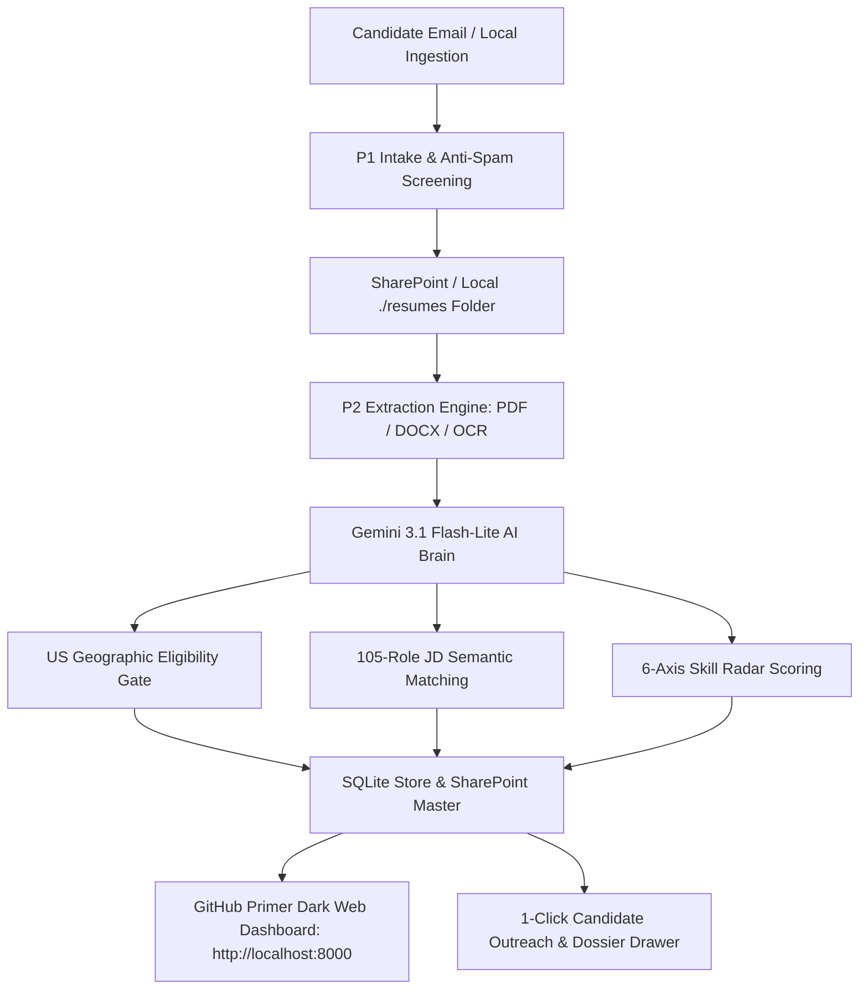

# DriverAI Hiring Agent

AI-powered dual-phase hiring intelligence pipeline and candidate evaluation suite for DriverAI.

**P1** automatically ingests, screens, and organizes incoming candidate emails from `apply@driverai.io`, safely depositing resumes and candidate records into SharePoint and local stores. **P2** extracts candidate details with multi-tier parsing (multi-column PDF, DOCX, OCR), evaluates qualifications against a 105-role matching matrix, filters US geographic eligibility, executes 6-axis skill radar scoring, and provides a modern **GitHub Primer Dark Web Dashboard**, desktop GUI, and CLI.

---

## ⚡ Key Highlights & Architecture



### 1. Modern Web Application (GitHub Primer Dark Theme)
- **Developer-Grade GitHub Primer Dark UI**: Dark theme (`#0d1117`), subheader breadcrumb (`driverai / hiring-agent-p2`), authentic DriverAI logo emblem, and clean badge statuses.
- **Interactive Command Palette (`Cmd+K` / `Ctrl+K`)**: Instant fuzzy search across candidates, skill sets, and job descriptions with quick keyboard navigation (`g d` Dashboard, `g c` Candidates, `g m` Matrix, `g r` Roles, `g a` Live Analyzer).
- **Live 4-Step Resume Parsing Stepper**: Visual real-time indicator (`1. OCR & Parsing` ➔ `2. US Geo Check` ➔ `3. 105-JD Match` ➔ `4. 6-Axis Radar`).
- **Rich Candidate Dossier Drawer & 1-Click Outreach**: Slide-out candidate dossier with 4 tabs (*Overview*, *Resume Extract*, *1-Click Outreach*, *Markdown Export*), pre-composed email templates (*Interview Invite*, *Non-USA Decline*, *5 Deep Probing Questions*), and one-click `mailto:` / copy triggers.
- **Comparison Matrix & Markdown Scorecard Export**: Compare candidates head-to-head across 6-axis competencies and export clean GitHub Markdown scorecards (`POST /api/candidates/export-markdown`).

### 2. Dual-Engine Intelligence (Gemini 3.1 & Ollama)
- **Gemini 3.1 Flash-Lite AI Brain**: High-throughput extraction, deep semantic reasoning, and 6-axis evaluation.
- **Local Ollama Fallback**: Local inference (`qwen3:1.7b` / `qwen3-1.7b-p2`) for zero-external-network or offline scoring.

### 3. Local Directory & OneDrive Ingestion Resiliency
- Ingest local batches of resumes directly from `./resumes` or local synced OneDrive folders (`POST /api/ingest/local-dir`) with zero Microsoft Entra / cloud credential configuration needed.

---

## 🚀 Quickstart

### Option 1: Modern Web Application (Recommended)

Start the local web server and open the GitHub Primer Dark dashboard in your browser:

```bash
cd DriverAI_HiringAgent/HiringAgent_P2
python bot.py --web --port 8000
```
Open **[http://localhost:8000](http://localhost:8000)** in your browser.

#### Web Interface Power-User Shortcuts:
- **`Cmd + K`** or **`Ctrl + K`**: Open Global Command Palette & Candidate Search.
- **`g` then `d`**: Navigate to Dashboard.
- **`g` then `c`**: Navigate to Candidates View.
- **`g` then `m`**: Navigate to Comparison Matrix.
- **`g` then `r`**: Navigate to 105-Role Library.
- **`g` then `a`**: Navigate to Live AI Resume Analyzer.
- **`Escape`**: Close modal dialogs or candidate dossier drawer.

---

### Option 2: Docker (macOS & Windows)

```bash
cd DriverAI_HiringAgent/HiringAgent_P2
cp .env.example .env
cp app_settings.example.json app_settings.json

docker compose build
docker compose run --rm p2 --doctor            # Check environment & dependencies
docker compose run --rm p2 --score-sharepoint --dry-run
docker compose run --rm p2 --score-sharepoint --batch-size 50
docker compose run --rm p2 --export-results
```

---

### Option 3: Native CLI & Desktop GUI

```bash
cd DriverAI_HiringAgent/HiringAgent_P2
python -m venv .venv
source .venv/bin/activate       # macOS / Linux
# or: .venv\Scripts\activate   # Windows

pip install -r requirements-desktop.txt

# Run CLI diagnostic
python bot.py --doctor

# Ingest local folder of resumes
python bot.py --ingest-dir ./resumes

# Launch Windows Desktop GUI (Windows only)
Launch.bat
```

---

## 📁 Repository Structure

```text
DriverAI-HiringAgent/
├── DriverAI_HiringAgent/
│   ├── HiringAgent_P1/                  # P1 Power Automate flow intake & email filters
│   │   ├── flow/                        # Flow definition & build scripts
│   │   └── docs/P1_RUNBOOK.md           # P1 operation & installation guide
│   ├── HiringAgent_P2/                  # P2 Extraction, Scoring & Web Application
│   │   ├── bot.py                       # Unified CLI, server & pipeline controller
│   │   ├── web_server.py                # REST API backend (FastAPI / stdlib server)
│   │   ├── static/                      # Web UI (GitHub Primer Dark theme, JS, CSS, Logo)
│   │   │   ├── index.html               # Main dashboard & single-page application
│   │   │   ├── style.css                # GitHub Primer Dark design tokens & animations
│   │   │   ├── app.js                   # Client controller, Command Palette, Stepper
│   │   │   └── driverai_logo.png        # Official DriverAI brand emblem
│   │   ├── hiring_agent/                # Core pipeline modules
│   │   │   ├── extractor.py             # Multi-tier text & OCR extraction engine
│   │   │   ├── ai_brain.py              # Gemini 3.1 & Ollama evaluation engines
│   │   │   ├── store.py                 # SQLite local-first storage layer
│   │   │   └── sharepoint_client.py     # Microsoft Graph & SharePoint client
│   │   ├── jd_roles_cache.json          # 105 DriverAI Job Descriptions cache
│   │   ├── resumes/                     # Local resume drop folder for zero-cloud ingestion
│   │   └── docs/                        # Complete P2 architecture, runbooks & benchmarks
│   ├── CLIENT_COMPUTER_START_HERE.md    # Client handoff quick reference
│   └── VERSION_STACK.md                 # Verified runtime, OCR, LLM, SQL stack
└── README.md                            # Root project overview & documentation
```

---

## ⚙️ Configuration & Environment

Copy `.env.example` to `.env` in `HiringAgent_P2/`:

| Variable | Description | Required For |
|---|---|---|
| `GEMINI_API_KEY` | Google Gemini 3.1 Flash-Lite API key | Gemini AI Brain scoring |
| `OLLAMA_HOST` | Local Ollama endpoint (e.g., `http://localhost:11434`) | Local offline scoring |
| `TENANT_ID` | Microsoft Azure Entra Tenant ID | SharePoint sync |
| `CLIENT_ID` | Microsoft Azure App Registration Client ID | SharePoint sync |
| `CLIENT_SECRET` | Microsoft Azure App Registration Client Secret | SharePoint sync |
| `SHAREPOINT_HOSTNAME` | SharePoint tenant URL (e.g., `driverai.sharepoint.com`) | SharePoint sync |
| `SHAREPOINT_SITE_PATH` | Path to SharePoint site | SharePoint sync |
| `HIRING_SUPPRESS_EMAILS` | `true` to suppress automated candidate emails | Safe staging/testing |

---

## 🧪 Testing & Validation

```bash
cd DriverAI_HiringAgent/HiringAgent_P2
python test_p2.py                    # Main test suite
python test_store.py                 # SQLite storage layer tests
python test_local_pipeline.py        # Local-first end-to-end pipeline test
python test_resume_availability.py   # Resume availability & retry tests
```

---

## 📚 Documentation Index

| Document | Description |
|---|---|
| [Client Handoff Guide](DriverAI_HiringAgent/HiringAgent_P2/CLIENT_COMPUTER_START_HERE.md) | Full computer setup, model setup, and local run guide |
| [P2 Manual Run Guide](DriverAI_HiringAgent/HiringAgent_P2/docs/P2_MANUAL_RUN_STEPS.md) | Web app, desktop app, and CLI step-by-step operating guide |
| [Current Architecture](DriverAI_HiringAgent/CURRENT_ARCHITECTURE.md) | Technical architecture, pipeline flow, and data contracts |
| [Version Stack](DriverAI_HiringAgent/VERSION_STACK.md) | Verified runtime versions (Python 3.12, Gemini 3.1, PyMuPDF, Tesseract) |
| [P1 Runbook](DriverAI_HiringAgent/HiringAgent_P1/docs/P1_RUNBOOK.md) | Power Automate flow deployment, testing, and mailbox management |

