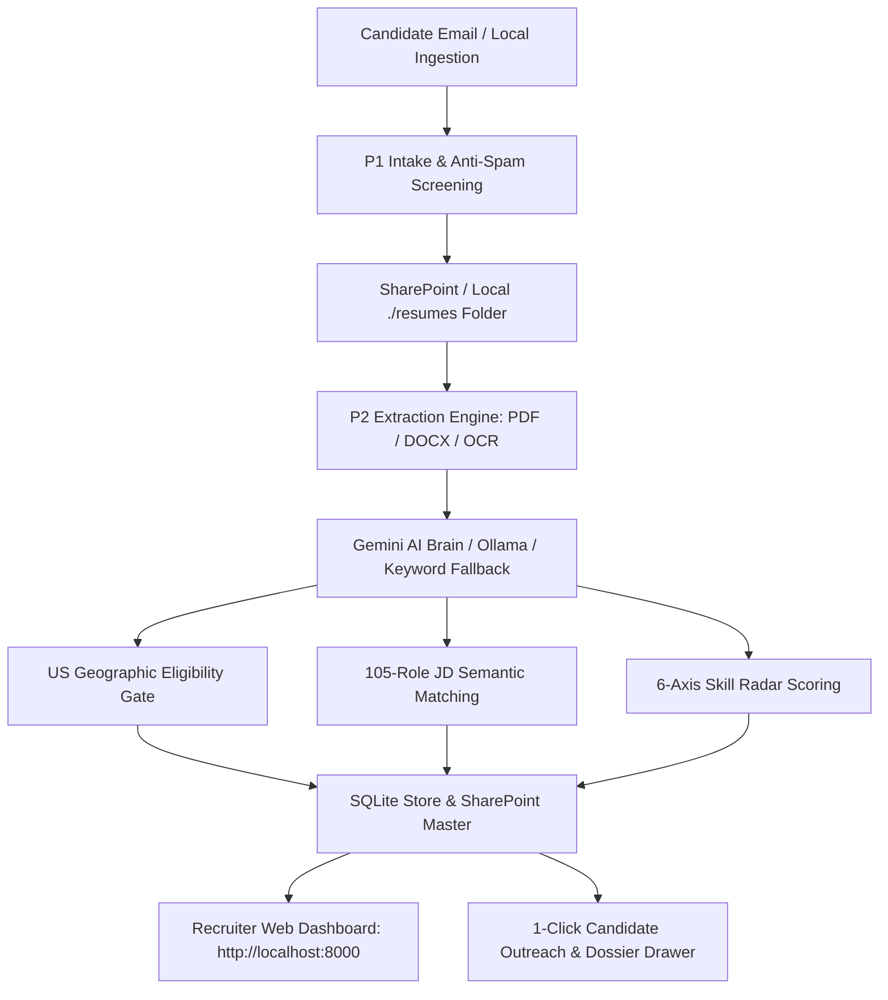

# DriverAI Hiring Agent

AI-powered dual-phase hiring intelligence pipeline and candidate evaluation suite for DriverAI.

**P1** automatically ingests, screens, and organizes incoming candidate emails from `apply@driverai.io`, safely depositing resumes and candidate records into SharePoint and local stores. **P2** extracts candidate details with multi-tier parsing (multi-column PDF, DOCX, OCR), evaluates qualifications against a 105-role matching matrix, filters US geographic eligibility, executes 6-axis skill radar scoring, and provides a modern **GitHub Primer Dark Web Dashboard**, desktop GUI, and CLI.

---

## ⚡ Key Highlights & Architecture



### 1. Modern Web Application (GitHub Primer Dark Theme)
- **Developer-Grade GitHub Primer Dark UI**: Dark theme (`#0d1117`), subheader breadcrumb (`driverai / hiring-agent-p2`), authentic DriverAI logo emblem, and clean badge statuses.
- **Interactive Command Palette (`Cmd+K` / `Ctrl+K`)**: Instant fuzzy search across candidates, skill sets, and job descriptions with quick keyboard navigation (`g d` Dashboard, `g c` Candidates, `g m` Matrix, `g r` Roles, `g a` Live Analyzer).
- **Live 4-Step Resume Parsing Stepper**: Visual real-time indicator (`1. OCR & Parsing` ➔ `2. US Geo Check` ➔ `3. 105-JD Match` ➔ `4. 6-Axis Radar`).
- **Rich Candidate Dossier Drawer & 1-Click Outreach**: Slide-out candidate dossier with 4 tabs (*Overview*, *Resume Extract*, *1-Click Outreach*, *Markdown Export*), pre-composed email templates (*Interview Invite*, *Non-USA Decline*, *5 Deep Probing Questions*), and one-click `mailto:` / copy triggers.
- **Comparison Matrix & Markdown Scorecard Export**: Compare candidates head-to-head across 6-axis competencies and export clean GitHub Markdown scorecards (`POST /api/candidates/export-markdown`).

### 2. Multi-Engine AI Brain & Resilient Fallbacks
- **Gemini Cloud AI Brain**: Fast, contextual extraction, role matching, and 6-axis radar evaluation via Google Gemini API.
- **Local Ollama Fallback**: Local inference (`qwen3:1.7b` / `qwen3-1.7b-p2`) for private, offline candidate evaluation.
- **Deterministic Keyword Matcher**: Always-available offline fallback requiring zero API keys or external dependencies.

### 3. Local Directory & OneDrive Ingestion Resiliency
- Ingest local batches of resumes directly from `./resumes` or local synced OneDrive folders (`POST /api/ingest/local-dir`) with zero cloud credential configuration needed.

---

## 🚀 1-Command Startup: Docker (Windows, Linux, macOS)

The easiest and recommended way to run the DriverAI Hiring Agent on any operating system without worrying about Python versions, OCR binaries, or C++ build tools:

```bash
# 1. Clone the repository
git clone https://github.com/akhil15123/DriverAI-HiringAgent.git
cd DriverAI-HiringAgent

# 2. Build and launch the stack
docker compose up --build
```

Open **[http://localhost:8000](http://localhost:8000)** in your browser!

* The web server, dashboard, REST API, and OCR engines start automatically.
* All data (database, results, logs, and dropped resumes) are persisted to the host machine.
* To stop the containers at any time:
  ```bash
  docker compose down
  ```

---

## 🪟 Windows Setup Guide

You can run the DriverAI Hiring Agent on Windows either using **Docker Desktop** (recommended) or **Natively with PowerShell / Command Prompt**.

### Method A: Docker Desktop on Windows (Recommended)
1. **Install Docker Desktop**:
   Download and install [Docker Desktop for Windows](https://www.docker.com/products/docker-desktop/) with the **WSL 2 backend** enabled.
2. **Launch the stack in PowerShell**:
   ```powershell
   git clone https://github.com/akhil15123/DriverAI-HiringAgent.git
   cd DriverAI-HiringAgent
   docker compose up --build
   ```
3. Open **[http://localhost:8000](http://localhost:8000)**.

---

### Method B: Native Windows Setup (PowerShell / CMD)

#### Step 1: Install Prerequisites
Open PowerShell as Administrator:
```powershell
# Install Python 3.12 via winget (or download from python.org; check "Add python.exe to PATH")
winget install -e --id Python.Python.3.12 --accept-source-agreements --accept-package-agreements

# Optional: Install Tesseract OCR for scanned PDF fallback
winget install -e --id UB-Mannheim.TesseractOCR --accept-source-agreements --accept-package-agreements

# Optional: Install Ollama for local offline AI
winget install -e --id Ollama.Ollama --accept-source-agreements --accept-package-agreements
```

#### Step 2: Set Up Virtual Environment & Dependencies
Open a standard PowerShell window in the project directory:
```powershell
cd DriverAI_HiringAgent\HiringAgent_P2

# If script execution is blocked on Windows, allow current user execution:
Set-ExecutionPolicy -ExecutionPolicy RemoteSigned -Scope CurrentUser

# Create and activate virtual environment
py -3.12 -m venv .venv
.\.venv\Scripts\Activate.ps1

# Upgrade pip and install dependencies
python -m pip install --upgrade pip
pip install -r requirements-docker.txt
```

#### Step 3: Launch the Application
* **To start the Web Application & Dashboard**:
  ```powershell
  python web_server.py
  ```
  Open **[http://localhost:8000](http://localhost:8000)** in your browser.

* **To run CLI diagnostics**:
  ```powershell
  python bot.py --doctor
  ```

* **To launch using pre-built Windows batch scripts**:
  ```cmd
  Launch.bat          :: Complete setup and desktop UI
  Start.bat           :: Quick launcher
  RunDaily.bat        :: Scheduled candidate batch processing
  ```

---

## 🐧 Linux Setup Guide (Ubuntu, Debian, RHEL, Fedora)

The DriverAI Hiring Agent runs natively on any modern Linux distribution without requiring a display server (X11/Wayland).

### Method A: Docker on Linux (Recommended)

1. **Install Docker and Docker Compose plugin** (Ubuntu/Debian):
   ```bash
   sudo apt-get update
   sudo apt-get install -y docker.io docker-compose-v2
   sudo usermod -aG docker $USER
   newgrp docker
   ```
2. **Clone and Run**:
   ```bash
   git clone https://github.com/akhil15123/DriverAI-HiringAgent.git
   cd DriverAI-HiringAgent
   docker compose up --build
   ```
3. Open **[http://localhost:8000](http://localhost:8000)**.

> **Note for Host Ollama on Linux**: `docker-compose.yml` is pre-configured with `extra_hosts: ["host.docker.internal:host-gateway"]`. If you have Ollama running on your Linux host (`ollama serve`), the container connects to it automatically at `http://host.docker.internal:11434`.

---

### Method B: Native Linux Setup (Ubuntu / Debian)

#### Step 1: Install System Packages
```bash
sudo apt-get update
sudo apt-get install -y \
    python3 \
    python3-venv \
    python3-pip \
    tesseract-ocr \
    tesseract-ocr-eng \
    curl
```

#### Step 2: Set Up Virtual Environment & Dependencies
```bash
cd DriverAI_HiringAgent/HiringAgent_P2

# Create virtual environment
python3 -m venv .venv
source .venv/bin/activate

# Install required Python packages
pip install --upgrade pip
pip install -r requirements-docker.txt
```

#### Step 3: Run the Application
* **Start Web Server & Dashboard**:
  ```bash
  python web_server.py
  # or specify host/port:
  # uvicorn web_server:app --host 0.0.0.0 --port 8000
  ```
  Access via **`http://<your-server-ip>:8000`** or **`http://localhost:8000`**.

* **Run CLI Diagnostics & Processing**:
  ```bash
  # Check environment & scoring readiness
  python bot.py --doctor

  # Score a local folder of resumes
  python bot.py --score-folder ./resumes

  # Run headless SharePoint synchronization
  python bot.py --score-sharepoint --dry-run
  ```

---

## 🍎 macOS Setup Guide (Apple Silicon M1/M2/M3/M4 & Intel)

DriverAI Hiring Agent runs natively and with full hardware acceleration on macOS (Sonoma, Ventura, Sequoia). Both **Apple Silicon** (ARM64) and **Intel** (x86_64) Macs are fully supported.

### Method A: Docker Desktop for Mac (Recommended)
1. **Install Docker Desktop**:
   Download [Docker Desktop for Mac](https://www.docker.com/products/docker-desktop/) (select **Apple Silicon** or **Intel Chip**).
2. **Clone & Launch in Terminal**:
   ```bash
   git clone https://github.com/akhil15123/DriverAI-HiringAgent.git
   cd DriverAI-HiringAgent
   docker compose up --build
   ```
3. Open **[http://localhost:8000](http://localhost:8000)** in Safari, Chrome, or any browser.

> **Ollama on Mac with Docker**: Docker Desktop automatically maps `host.docker.internal:11434` to your host Mac. If you run Ollama natively on macOS, the Docker container connects to your Mac's Metal-accelerated Ollama instance with zero configuration.

---

### Method B: Native macOS Setup (Terminal / zsh)

#### Step 1: Install Homebrew & System Prerequisites
If you don't have Homebrew installed, open Terminal and run:
```bash
/bin/bash -c "$(curl -fsSL https://raw.githubusercontent.com/Homebrew/install/HEAD/install.sh)"
```

Then install Python 3.12, Tesseract OCR, and optionally Ollama:
```bash
# Core Python runtime and OCR fallback
brew install python@3.12 tesseract tesseract-lang

# Optional: Install Ollama for local offline AI
brew install --cask ollama
```

#### Step 2: Set Up Virtual Environment & Dependencies
```bash
cd DriverAI_HiringAgent/HiringAgent_P2

# Create virtual environment with Python 3.12
python3.12 -m venv .venv
source .venv/bin/activate

# Upgrade pip and install dependencies
pip install --upgrade pip
pip install -r requirements-docker.txt
```

#### Step 3: Run the Application on macOS
* **Start Web Server & Recruiter Dashboard**:
  ```bash
  python web_server.py
  # or specify a custom port:
  # PORT=8080 python web_server.py
  ```
  Open **[http://localhost:8000](http://localhost:8000)** in your browser.

* **Run CLI Diagnostics & Processing**:
  ```bash
  # Check environment readiness
  python bot.py --doctor

  # Score a local folder of candidate resumes
  python bot.py --score-folder ./resumes

  # Run SharePoint scoring dry-run
  python bot.py --score-sharepoint --dry-run
  ```

#### ⚡ Apple Silicon Performance Tip (Metal GPU Acceleration)
On Apple Silicon Macs (M1/M2/M3/M4), running Ollama natively on macOS leverages unified memory architecture (UMA) and Metal GPU acceleration for lightning-fast token generation:
```bash
# Pull model and launch server in background
ollama run qwen3:1.7b
```
DriverAI Hiring Agent detects `http://localhost:11434` automatically and executes local candidate scoring with near-zero latency.

---

---

## 🧠 Google Gemini Cloud AI Setup (Recommended AI Engine)

The DriverAI Hiring Agent leverages Google Gemini API for:
* **4-Step Real-Time Resume Parsing**: Extracts structured candidate entities (Full Name, Email, Phone, US Geo validation, Skills list, Education degrees, Target role).
* **105-Role Semantic Matching**: Contextual qualification rating (0–100 scale) against all DriverAI technical job descriptions.
* **6-Axis Skill Radar Scoring**: Multi-dimensional scoring across Core Engineering, Systems, ML/AI, Production, Leadership, and Communication.
* **Interactive Recruiter Copilot**: Contextual candidate QA and resume inspection directly within the web dashboard.

### Step 1: Obtain a Gemini API Key
1. Go to [Google AI Studio](https://aistudio.google.com/).
2. Sign in with your Google account.
3. Click **Get API key** ➔ **Create API key** (in a new or existing Google Cloud project).
4. Copy your API key (`AIzaSy...`).

### Step 2: Add Gemini Key to `.env`
Create or edit `.env` in the repository root or in `DriverAI_HiringAgent/HiringAgent_P2/.env`:
```ini
GEMINI_API_KEY=AIzaSyYourGeminiApiKeyHere
HIRING_GEMINI_MODEL=gemini-2.5-flash
HIRING_GEMINI_ENABLED=true
```
*(Supports `gemini-2.5-flash`, `gemini-2.0-flash`, or `gemini-1.5-flash`).*

### Step 3: Verify Gemini Connectivity
Run diagnostics:
```bash
python bot.py --doctor
```
Or check the `/health` endpoint while the web server is running:
```bash
curl http://localhost:8000/health
```
You will see:
```json
{
  "status": "healthy",
  "gemini": {
    "configured": true,
    "model": "gemini-2.5-flash"
  }
}
```

### Fallback Hierarchy (Zero Downtime)
If Gemini is not configured or an API quota limit is reached, the system automatically falls back gracefully:
1. **Gemini Cloud AI** (Primary — fast, intelligent semantic matching)
2. **Local Ollama** (Fallback — private local weights: `qwen3:1.7b`)
3. **Deterministic Scorer** (Offline Fallback — built-in regex & keyword matching, zero API keys required)

---

## 🏢 Microsoft 365 & SharePoint Setup Guide (Azure Entra ID & P1 Flow)

The DriverAI Hiring Agent operates across two synchronized Microsoft tiers:
1. **Phase 1 (P1 Cloud Ingestion)**: An automated Microsoft Power Automate flow running 24/7 in the Microsoft Cloud watching `apply@driverai.io`, screening anti-spam, depositing resumes into `/Candidate_Resumes/YYYY/MM/`, and creating candidate rows in `Sharepoint_Master_File.xlsx`.
2. **Phase 2 (P2 Scoring & Evaluation)**: Connects headlessly to SharePoint via **Microsoft Entra ID (Azure AD)** using client credentials (app-only authentication) without requiring interactive browser login.

### Step 1: Register Microsoft Entra ID (Azure AD) Application
1. Sign in to the [Microsoft Entra Admin Center](https://entra.microsoft.com/) or [Azure Portal](https://portal.azure.com/).
2. Navigate to **Identity** ➔ **Applications** ➔ **App registrations** ➔ Click **New registration**.
3. Set Name: `DriverAI-HiringAgent-P2`.
4. Set Supported account types: *Accounts in this organizational directory only (Single tenant)*.
5. Click **Register**.
6. Copy the following identifiers from the Overview page:
   * **Application (client) ID** ➔ `CLIENT_ID`
   * **Directory (tenant) ID** ➔ `TENANT_ID`

### Step 2: Generate Client Secret
1. In your App Registration sidebar, click **Certificates & secrets** ➔ **Client secrets** tab.
2. Click **New client secret**.
3. Enter Description (e.g., `HiringAgent Production Secret`) and set an expiration period (e.g., 180 days).
4. Click **Add**.
5. **CRITICAL**: Immediately copy the **Value** column (NOT the Secret ID). The secret value is never displayed again once you leave the page. ➔ `CLIENT_SECRET`.

### Step 3: Configure Microsoft Graph Application Permissions
1. In the sidebar, click **API permissions** ➔ **Add a permission**.
2. Select **Microsoft Graph**.
3. Select **Application permissions** *(important: do NOT choose Delegated permissions; headless backend workers run without a signed-in user)*.
4. Search for and check the following permissions:
   * **`Sites.ReadWrite.All`**: Allows reading and updating the candidate Excel master table and saving resumes.
   * **`Files.ReadWrite.All`**: Allows uploading candidate scorecards and generated Excel results.
   * **`Mail.Send`** *(Optional)*: Needed only if P2 candidate rejection or notification emails are enabled.
5. Click **Add permissions**.
6. **CRITICAL**: Click **"Grant admin consent for <Your Organization>"** and confirm. Ensure all permissions display a green status icon (*"Granted for..."*).

### Step 4: Add Microsoft Credentials to `.env`
Update your `.env` file:
```ini
# Microsoft Entra ID (Azure AD) Credentials
TENANT_ID=00000000-0000-0000-0000-000000000000
CLIENT_ID=00000000-0000-0000-0000-000000000000
CLIENT_SECRET=your_client_secret_value_here

# SharePoint Tenant & Addressing
SHAREPOINT_HOSTNAME=driverai.sharepoint.com
SHAREPOINT_SITE_PATH=/sites/CandidateList_HiringAgent
SHAREPOINT_TABLE=HiringAgent_P1_Candidates
SHAREPOINT_WORKBOOK=/Master_Files/Sharepoint_Master_File.xlsx
SHAREPOINT_RESUMES_FOLDER=/Candidate_Resumes
SENDER_MAILBOX=apply@driverai.io

# ⚠️ Safety Master Switch: Keep TRUE for staging/testing to prevent sending live emails
HIRING_SUPPRESS_EMAILS=true

# Filter candidates to US geographical eligibility
HIRING_GEO_USA_ONLY=true
```

### Step 5: Test Microsoft & SharePoint Connection
Verify credentials, site resolution, Excel table access, and resume folders with a single test command:
```bash
# Test connection (read-only):
python bot.py --test-sharepoint

# Or run via Docker:
docker compose run --rm cli --test-sharepoint
```

If credentials and permissions are correct, you will see:
```text
✓ Microsoft Graph token acquired successfully
✓ SharePoint Site resolved: /sites/CandidateList_HiringAgent
✓ Candidate Excel table found: HiringAgent_P1_Candidates
✓ Resumes folder verified: /Candidate_Resumes
```

### Phase 1 Power Automate Flow Deployment
If setting up P1 intake in a new Microsoft 365 tenant:
1. Open **Power Automate** (`make.powerautomate.com`).
2. Go to **My flows** ➔ **Import** ➔ **Import Package (Legacy)**.
3. Upload `DriverAI_HiringAgent/HiringAgent_P1/flow/DriverAI-Hiring-AutoReply-apply.zip`.
4. Authorize connections for **Office 365 Outlook**, **SharePoint**, and **Excel Online (Business)**.
5. Refer to [`P1_RUNBOOK.md`](DriverAI_HiringAgent/HiringAgent_P1/docs/P1_RUNBOOK.md) for full mailbox and table routing verification.

---

## ⌨️ Web Dashboard Shortcuts & Navigation

| Keybinding | Action |
|---|---|
| **`Cmd + K`** / **`Ctrl + K`** | Global Command Palette & Fuzzy Candidate Search |
| **`g` then `d`** | Jump to **Dashboard** |
| **`g` then `c`** | Jump to **Candidates Pipeline** |
| **`g` then `m`** | Jump to **Comparison Matrix** |
| **`g` then `r`** | Jump to **105-Role Library** |
| **`g` then `a`** | Open **Live AI Resume Analyzer** |
| **`Escape`** | Close modal dialogs or slide-out dossier drawers |

---

## ⚙️ Configuration & Environment Reference

| Variable | Description | Default / Example | Required For |
|---|---|---|---|
| `GEMINI_API_KEY` | Google Gemini API key | `AIzaSy...` | Cloud AI scoring |
| `HIRING_GEMINI_MODEL` | Gemini model name | `gemini-2.5-flash` | Cloud AI scoring |
| `HIRING_OLLAMA_HOST` | Ollama service address | `http://localhost:11434` | Local Ollama scoring |
| `PORT` | Web server listening port | `8000` | Web deployment |
| `TENANT_ID` | Microsoft Azure Entra Tenant ID | `7399f3ca-...` | Live SharePoint sync |
| `CLIENT_ID` | Azure App Registration Client ID | `3e1c615f-...` | Live SharePoint sync |
| `CLIENT_SECRET` | Azure App Registration Client Secret | `2LA8Q~...` | Live SharePoint sync |
| `SHAREPOINT_HOSTNAME` | SharePoint tenant hostname | `driverai.sharepoint.com` | Live SharePoint sync |
| `SHAREPOINT_SITE_PATH` | Path to candidate SharePoint site | `/sites/CandidateList_HiringAgent` | Live SharePoint sync |
| `HIRING_SUPPRESS_EMAILS` | Suppress candidate outreach emails | `true` | Testing & staging |

---

## 🧪 Testing & Validation

Run the test suite across both phases:

```bash
cd DriverAI_HiringAgent/HiringAgent_P2

# Run Phase 1 flow tests (~55 synthetic candidate routing cases):
python ../HiringAgent_P1/test_p1.py

# Run Phase 2 tests:
python test_p2.py                    # Main test suite
python test_store.py                 # SQLite storage layer tests
python test_local_pipeline.py        # End-to-end local scoring pipeline
python test_resume_availability.py   # Resume fetching and resilience tests
```

---

## 📁 Repository Structure

```text
DriverAI-HiringAgent/
├── Dockerfile                           # Multi-OS Docker container definition
├── docker-compose.yml                   # 1-command Docker Compose stack (Web & CLI)
├── requirements-docker.txt              # Standardized container dependencies
├── .dockerignore                        # Docker build optimization rules
├── README.md                            # Comprehensive setup & operational guide
└── DriverAI_HiringAgent/
    ├── HiringAgent_P1/                  # Phase 1: Intake, auto-reply, spam screening
    │   ├── flow/                        # Power Automate flow package & build tools
    │   └── docs/P1_RUNBOOK.md           # P1 deployment runbook
    └── HiringAgent_P2/                  # Phase 2: Extraction, Scoring, Web UI & CLI
        ├── web_server.py                # FastAPI server & REST API
        ├── bot.py                       # CLI and background controller
        ├── static/                      # Single-page web app (GitHub Primer Dark theme)
        │   ├── index.html               # Main recruiter dashboard
        │   ├── app.js                   # UI controller, Command Palette, Stepper
        │   ├── style.css                # Dark mode styles & glassmorphic tokens
        │   └── driverai_logo.png        # Official DriverAI brand emblem
        ├── hiring_agent/                # Scoring & extraction core
        │   ├── extraction.py            # Multi-tier text & OCR parser
        │   ├── gemini_scorer.py         # Gemini Cloud AI evaluation
        │   ├── ollama_scorer.py         # Local Ollama AI evaluation
        │   ├── local_scorer.py          # Deterministic keyword scorer
        │   ├── sharepoint_scoring.py    # SharePoint synchronization
        │   ├── sqlite_store.py          # SQLite candidate storage
        │   └── config.py                # Environment & business rules
        ├── jd_roles_cache.json          # 105 DriverAI role profiles
        ├── resumes/                     # Local resume drop folder
        ├── Launch.bat                   # 1-click Windows launcher
        ├── Start.bat                    # Windows quick start script
        └── RunDaily.bat                 # Windows scheduled batch worker
```

---

## 📚 Documentation Index

| Document | Description |
|---|---|
| [Client Handoff Guide](file:///Users/akhilb/.gemini/antigravity-ide/scratch/DriverAI-HiringAgent/DriverAI_HiringAgent/HiringAgent_P2/CLIENT_COMPUTER_START_HERE.md) | Full computer setup, model setup, and local run guide |
| [P2 Manual Run Guide](file:///Users/akhilb/.gemini/antigravity-ide/scratch/DriverAI-HiringAgent/DriverAI_HiringAgent/HiringAgent_P2/docs/P2_MANUAL_RUN_STEPS.md) | Web app, desktop app, and CLI step-by-step operating guide |
| [P1 Runbook](file:///Users/akhilb/.gemini/antigravity-ide/scratch/DriverAI-HiringAgent/DriverAI_HiringAgent/HiringAgent_P1/docs/P1_RUNBOOK.md) | Power Automate flow deployment, testing, and mailbox management |
| [Version Stack](file:///Users/akhilb/.gemini/antigravity-ide/scratch/DriverAI-HiringAgent/DriverAI_HiringAgent/VERSION_STACK.md) | Verified runtime versions (Python, Gemini, PyMuPDF, RapidOCR, Tesseract) |
