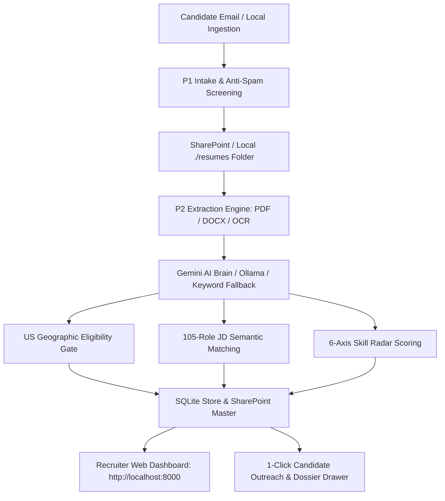

# DriverAI Hiring Agent

AI-powered dual-phase hiring intelligence pipeline and candidate evaluation suite for DriverAI.

**P1** automatically ingests, screens, and organizes incoming candidate emails from `apply@driverai.io`, safely depositing resumes and candidate records into SharePoint and local stores. **P2** extracts candidate details with multi-tier parsing (multi-column PDF, DOCX, OCR), evaluates qualifications against a 105-role matching matrix, filters US geographic eligibility, executes 6-axis skill radar scoring, and provides a modern **GitHub Primer Dark Web Dashboard**, desktop GUI, and CLI.

---

## ⚡ Key Highlights & Architecture



### 1. Modern Web Application (GitHub Primer Dark Theme)
- **Developer-Grade GitHub Primer Dark UI**: Dark theme (`#0d1117`), subheader breadcrumb (`driverai / hiring-agent-p2`), authentic DriverAI logo emblem, and clean badge statuses.
- **Interactive Command Palette (`Cmd+K` / `Ctrl+K`)**: Instant fuzzy search across candidates, skill sets, and job descriptions with quick keyboard navigation (`g d` Dashboard, `g c` Candidates, `g m` Matrix, `g r` Roles, `g a` Live Analyzer).
- **Live 4-Step Resume Parsing Stepper**: Visual real-time indicator (`1. OCR & Parsing` ➔ `2. US Geo Check` ➔ `3. 105-JD Match` ➔ `4. 6-Axis Radar`).
- **Rich Candidate Dossier Drawer & 1-Click Outreach**: Slide-out candidate dossier with 4 tabs (*Overview*, *Resume Extract*, *1-Click Outreach*, *Markdown Export*), pre-composed email templates (*Interview Invite*, *Non-USA Decline*, *5 Deep Probing Questions*), and one-click `mailto:` / copy triggers.
- **Comparison Matrix & Markdown Scorecard Export**: Compare candidates head-to-head across 6-axis competencies and export clean GitHub Markdown scorecards (`POST /api/candidates/export-markdown`).

### 2. Multi-Engine AI Brain & Resilient Fallbacks
- **Gemini Cloud AI Brain**: Fast, contextual extraction, role matching, and 6-axis radar evaluation via Gemini API.
- **Local Ollama Fallback**: Local inference (`qwen3:1.7b` / `qwen3-1.7b-p2`) for private, offline candidate evaluation.
- **Deterministic Keyword Matcher**: Always available offline fallback requiring zero API keys or external dependencies.

### 3. Local Directory & OneDrive Ingestion Resiliency
- Ingest local batches of resumes directly from `./resumes` or local synced OneDrive folders (`POST /api/ingest/local-dir`) with zero cloud credential configuration needed.

---

## 🚀 Quickstart

### Option 1: 🐳 Docker (Recommended — Run in 1 Command)

Run the entire stack (FastAPI web server, Glassmorphic recruiter UI, OCR, and scoring engine) anywhere without configuring a local Python environment:

```bash
# 1. From the repository root, start the web server & dashboard:
docker compose up --build
```

Open **[http://localhost:8000](http://localhost:8000)** in your browser!

#### Optional Environment Configuration:
To enable Gemini Cloud AI scoring or live SharePoint synchronization, create a `.env` file at repository root or inside `DriverAI_HiringAgent/HiringAgent_P2/.env`:
```bash
cp DriverAI_HiringAgent/HiringAgent_P2/.env.example .env
# Add your GEMINI_API_KEY or Azure SharePoint credentials if available
```
*(If no `.env` or keys are provided, the system runs completely in local offline mode using the deterministic scorer and sample benchmark candidate data).*

#### Running CLI Operations in Docker:
```bash
# Run system & environment diagnostics:
docker compose run --rm cli --doctor

# Score a folder of resumes:
docker compose run --rm cli --score-folder ./resumes

# Run read-only SharePoint test:
docker compose run --rm cli --test-sharepoint
docker compose run --rm cli --score-sharepoint --dry-run
```

#### Stopping Docker Containers:
```bash
docker compose down
```

---

### Option 2: 💻 Local Native Web Application

If you prefer running natively with Python on macOS, Linux, or Windows:

```bash
cd DriverAI_HiringAgent/HiringAgent_P2

# 1. Create and activate a virtual environment
python -m venv .venv
source .venv/bin/activate       # macOS / Linux
# or: .venv\Scripts\activate   # Windows

# 2. Install dependencies
pip install -r requirements-docker.txt

# 3. Launch the web server
python web_server.py
# or: python bot.py --web --port 8000
```

Open **[http://localhost:8000](http://localhost:8000)** in your browser.

#### Web Interface Power-User Shortcuts:
- **`Cmd + K`** or **`Ctrl + K`**: Open Global Command Palette & Candidate Search.
- **`g` then `d`**: Navigate to Dashboard.
- **`g` then `c`**: Navigate to Candidates View.
- **`g` then `m`**: Navigate to Comparison Matrix.
- **`g` then `r`**: Navigate to 105-Role Library.
- **`g` then `a`**: Navigate to Live AI Resume Analyzer.
- **`Escape`**: Close modal dialogs or candidate dossier drawer.

---

### Option 3: 🖥️ Native CLI & Desktop GUI

```bash
cd DriverAI_HiringAgent/HiringAgent_P2
source .venv/bin/activate

# Run CLI diagnostic
python bot.py --doctor

# Ingest a local folder of resumes
python bot.py --score-folder ./resumes

# Launch Windows Desktop GUI (Windows only)
Launch.bat
```

---

## 📁 Repository Structure

```text
DriverAI-HiringAgent/
├── Dockerfile                           # Production Docker image (FastAPI Web UI + OCR + CLI)
├── docker-compose.yml                   # 1-command Docker Compose stack (Web & CLI services)
├── requirements-docker.txt              # Containerized runtime dependencies
├── .dockerignore                        # Docker build optimization rules
├── README.md                            # Main project overview & documentation
└── DriverAI_HiringAgent/
    ├── HiringAgent_P1/                  # P1 Power Automate flow intake & email filters
    │   ├── flow/                        # Flow definition & build scripts
    │   └── docs/P1_RUNBOOK.md           # P1 operation & installation guide
    └── HiringAgent_P2/                  # P2 Extraction, Scoring & Web Application
        ├── web_server.py                # REST API backend (FastAPI, Web UI endpoints)
        ├── bot.py                       # Unified CLI, server & pipeline controller
        ├── static/                      # Modern Web UI (GitHub Primer Dark theme)
        │   ├── index.html               # Main single-page application & recruiter dashboard
        │   ├── style.css                # Dark theme design tokens, glassmorphism & layout
        │   ├── app.js                   # Client controller, Command Palette, Stepper
        │   └── driverai_logo.png        # Official DriverAI brand emblem
        ├── hiring_agent/                # Core pipeline modules
        │   ├── extraction.py            # Multi-tier text & OCR extraction engine
        │   ├── gemini_scorer.py         # Gemini Cloud AI extraction & 105-role matching
        │   ├── ollama_scorer.py         # Local Ollama AI evaluation
        │   ├── local_scorer.py          # Deterministic keyword scoring
        │   ├── sharepoint_scoring.py    # SharePoint workbook synchronization
        │   ├── sqlite_store.py          # Local SQLite storage layer
        │   └── config.py                # Business rules and environment configuration
        ├── jd_roles_cache.json          # 105 DriverAI Job Descriptions cache
        ├── resumes/                     # Local resume drop folder for zero-cloud ingestion
        └── docs/                        # Complete P2 architecture, runbooks & benchmarks
```

---

## ⚙️ Configuration & Environment

Copy `.env.example` to `.env` (either at the repository root or inside `DriverAI_HiringAgent/HiringAgent_P2/`):

| Variable | Description | Required For |
|---|---|---|
| `GEMINI_API_KEY` | Google Gemini API key (e.g. `gemini-2.5-flash`) | Cloud AI Brain extraction & scoring |
| `HIRING_OLLAMA_HOST` | Local Ollama endpoint (e.g. `http://localhost:11434`) | Local offline AI scoring |
| `PORT` | Web server port (default: `8000`) | Web server deployment |
| `TENANT_ID` | Microsoft Azure Entra Tenant ID | Live SharePoint sync |
| `CLIENT_ID` | Microsoft Azure App Registration Client ID | Live SharePoint sync |
| `CLIENT_SECRET` | Microsoft Azure App Registration Client Secret | Live SharePoint sync |
| `SHAREPOINT_HOSTNAME` | SharePoint tenant URL (e.g. `driverai.sharepoint.com`) | Live SharePoint sync |
| `SHAREPOINT_SITE_PATH` | Path to SharePoint site | Live SharePoint sync |
| `HIRING_SUPPRESS_EMAILS` | `true` to suppress automated candidate emails | Safe staging & testing |

---

## 🧪 Testing & Verification

```bash
cd DriverAI_HiringAgent/HiringAgent_P2

# Structural validation & P1 flow simulation (~55 scenarios):
python ../HiringAgent_P1/test_p1.py

# P2 Pipeline and store tests:
python test_p2.py                    # Main test suite
python test_store.py                 # SQLite storage layer tests
python test_local_pipeline.py        # Local-first end-to-end pipeline test
python test_resume_availability.py   # Resume availability & retry tests
```

---

## 📚 Documentation Index

| Document | Description |
|---|---|
| [Client Handoff Guide](file:///Users/akhilb/.gemini/antigravity-ide/scratch/DriverAI-HiringAgent/DriverAI_HiringAgent/HiringAgent_P2/CLIENT_COMPUTER_START_HERE.md) | Full computer setup, model setup, and local run guide |
| [P2 Manual Run Guide](file:///Users/akhilb/.gemini/antigravity-ide/scratch/DriverAI-HiringAgent/DriverAI_HiringAgent/HiringAgent_P2/docs/P2_MANUAL_RUN_STEPS.md) | Web app, desktop app, and CLI step-by-step operating guide |
| [P1 Runbook](file:///Users/akhilb/.gemini/antigravity-ide/scratch/DriverAI-HiringAgent/DriverAI_HiringAgent/HiringAgent_P1/docs/P1_RUNBOOK.md) | Power Automate flow deployment, testing, and mailbox management |
| [Version Stack](file:///Users/akhilb/.gemini/antigravity-ide/scratch/DriverAI-HiringAgent/DriverAI_HiringAgent/VERSION_STACK.md) | Verified runtime versions (Python, Gemini, PyMuPDF, RapidOCR, Tesseract) |
